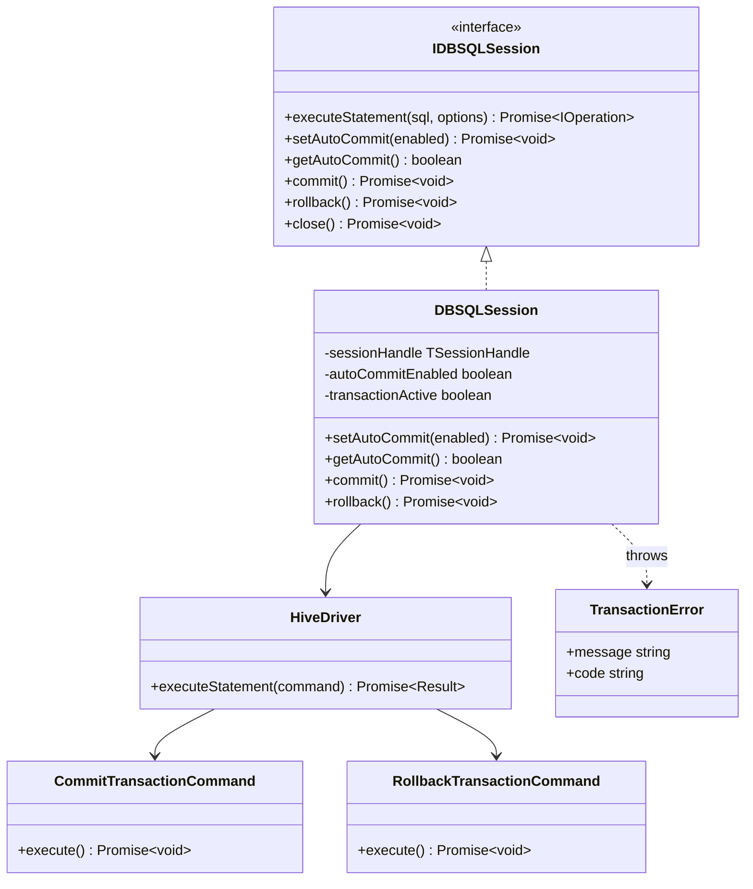
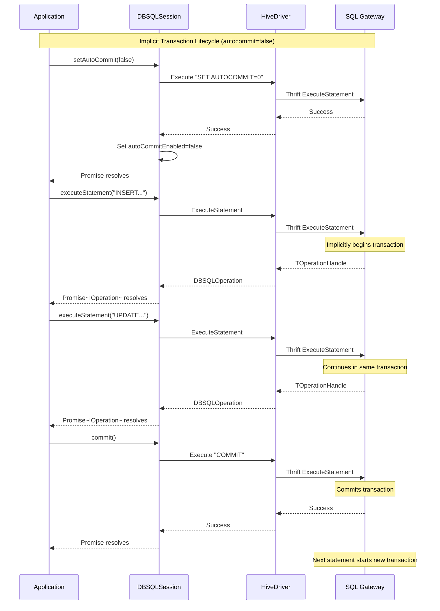
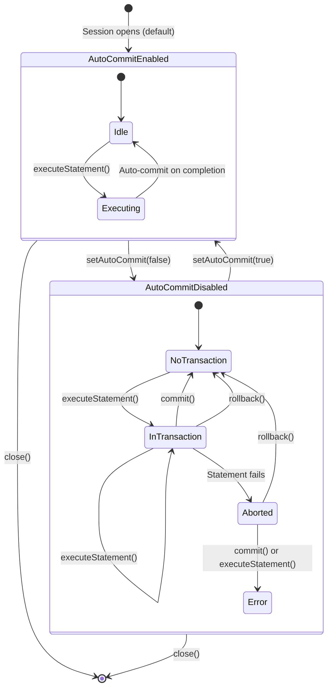
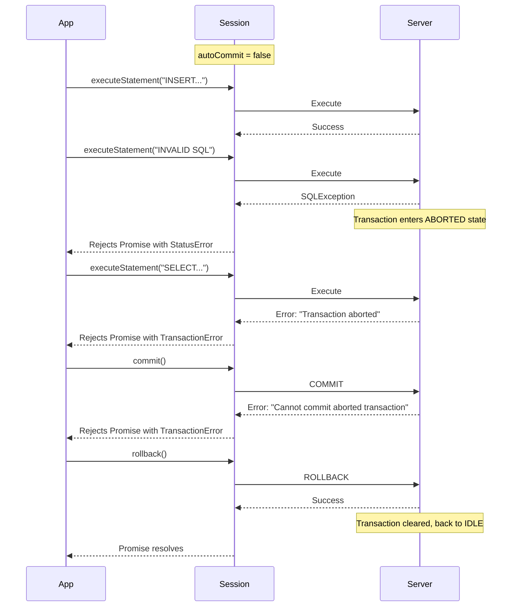
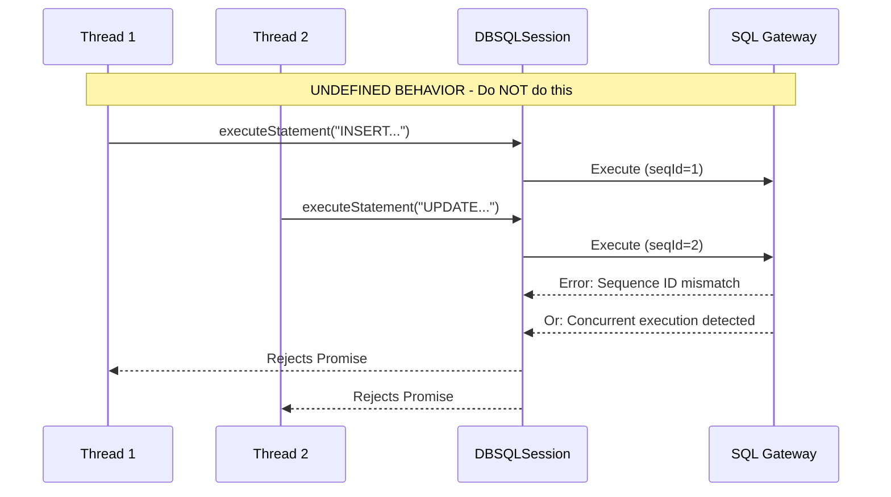

# Design Doc: Node.js Driver Support for Multi-Statement Transactions

| Field | Value |
|-------|-------|
| **Author(s)** | [Your Name] |
| **Date Last Modified** | 2025-11-04 |
| **Status or outcome** | IN REVIEW |
| **Any security considerations or are you making API changes?** | No |
| **TL sign off?** | ☐ [Name] ☐ Date |

## Reference Docs
- [DBSQL CP] Interactive MSTs on xDBC
- Design Doc: Interactive Multi-Statement Transactions (MSTs) for DBSQL
- [PRD] Multi-statement / multi-table transactions
- [One Pager] AutoCommit State in xDBC for MSTs
- [JDBC MST Design Doc](reference to JDBC design)
- [JDBC MST PR #1060](https://github.com/databricks/databricks-jdbc/pull/1060)

---

## Introduction

This document outlines the design for implementing interactive Multi-Statement Transaction (MST) support within the Databricks Node.js driver (`databricks-sql-nodejs`). The primary goal is to provide a standard, client-side mechanism for transaction control that aligns with industry practices and database driver conventions while respecting Node.js idioms and patterns.

This feature is critical for:
- Enabling complex data manipulation workloads with transactional guarantees
- Ensuring data integrity across multiple statement executions
- Facilitating migration of applications from other data warehousing platforms
- Supporting standard database transaction patterns in Node.js applications

### Key Design Principles

1. **Promise-Based API**: All transaction methods return Promises, consistent with the driver's async/await patterns
2. **Implicit Transactions Only**: Transaction boundaries controlled via `setAutoCommit()`, not explicit `BEGIN` commands
3. **No SQL Parsing**: The driver will not parse SQL strings to detect transaction commands
4. **Server-Side State**: Transaction state managed by SQL Gateway and DBR, not the driver
5. **Strict Error Handling**: Clear, predictable error behavior for transaction failures

---

## Requirements

### In Scope

The driver implementation will provide:

- **AutoCommit Control**: Methods to enable/disable autocommit mode on the session
- **Transaction Boundaries**: Methods to commit or rollback transactions
- **State Tracking**: Client-side caching of autocommit state for performance
- **Error Handling**: Clear exceptions for invalid transaction operations
- **Session Integration**: Transaction support integrated with existing session lifecycle

### Design Constraints

- **No Client Transaction State**: The driver will not track which statements belong to a transaction
- **Server Enforces Sequential Execution**: The server requires strict sequential execution within transactions
- **No Concurrent Statement Enforcement**: The driver will not prevent concurrent statement execution (undefined behavior if attempted)
- **Implicit Transaction Lifecycle Only**: Transactions begin implicitly when autocommit is disabled

### Out of Scope

- Explicit `BEGIN TRANSACTION` API method (use `setAutoCommit(false)` instead)
- Savepoint support
- Transaction isolation level configuration (only SERIALIZABLE supported)
- Automatic operation queuing/serialization
- Distributed/XA transactions
- Legacy callback-based APIs (Promise-only)

---

## High-Level Design

### Architecture Overview



### Transaction Lifecycle

The server-side architecture imposes a clear contract for managing transactions:



### AutoCommit State Management



---

## Detailed Interface Design

### IDBSQLSession Interface Extensions

```typescript
interface IDBSQLSession {
  // Existing methods...
  executeStatement(statement: string, options?: ExecuteStatementOptions): Promise<IOperation>;
  close(): Promise<void>;

  // NEW: Transaction control methods
  /**
   * Sets the autocommit mode for this session.
   *
   * When autocommit is true (default):
   * - Each statement executes and commits immediately
   * - commit() and rollback() are no-ops
   *
   * When autocommit is false:
   * - First statement implicitly begins a transaction
   * - Subsequent statements execute within the same transaction
   * - Must call commit() or rollback() to complete the transaction
   * - Next statement after commit/rollback starts a new transaction
   *
   * @param enabled - true to enable autocommit, false to disable
   * @throws {TransactionError} If called while a transaction is in aborted state
   */
  setAutoCommit(enabled: boolean): Promise<void>;

  /**
   * Returns the current autocommit mode for this session.
   *
   * This value is cached on the client side. It reflects the last
   * setAutoCommit() call or the default value (true) if never set.
   *
   * @returns true if autocommit is enabled, false otherwise
   */
  getAutoCommit(): boolean;

  /**
   * Commits the current transaction.
   *
   * Behavior:
   * - If autocommit is true: No-op, returns successfully
   * - If autocommit is false and transaction is active: Commits the transaction
   * - If autocommit is false and no transaction is active: No-op, returns successfully
   * - If transaction is in aborted state: Throws TransactionError
   *
   * @throws {TransactionError} If transaction is in aborted state
   */
  commit(): Promise<void>;

  /**
   * Rolls back the current transaction.
   *
   * Behavior:
   * - If autocommit is true: Throws TransactionError (no transaction to rollback)
   * - If autocommit is false and transaction is active: Rolls back the transaction
   * - If autocommit is false and no transaction is active: Throws TransactionError
   * - If transaction is in aborted state: Clears aborted state and returns successfully
   *
   * @throws {TransactionError} If autocommit is true or no transaction exists
   */
  rollback(): Promise<void>;
}
```

### Session Configuration

```typescript
interface OpenSessionRequest {
  initialCatalog?: string;
  initialSchema?: string;
  configuration?: { [key: string]: string };

  // NEW: Initial autocommit state
  /**
   * Sets the initial autocommit mode for the session.
   * Default: true
   */
  autoCommit?: boolean;
}
```

Example usage:

```typescript
const session = await client.openSession({
  initialCatalog: 'main',
  initialSchema: 'default',
  autoCommit: false  // Start with autocommit disabled
});
```

### Transaction Error Class

```typescript
/**
 * Error thrown when transaction operations fail or are used incorrectly.
 */
class TransactionError extends HiveDriverError {
  constructor(message: string, code: TransactionErrorCode) {
    super(message);
    this.name = 'TransactionError';
    this.code = code;
  }
}

enum TransactionErrorCode {
  NoActiveTransaction = 'ENOTRANSACTION',
  TransactionAborted = 'ETRANSACTIONABORTED',
  InvalidOperation = 'EINVALIDTRANSACTIONOP'
}
```

---

## Error Handling and Aborted State

### Transaction Failure Scenarios

When a statement fails during a transaction, the server automatically transitions the transaction into an **aborted state**.



### Error Handling Contract

| Operation | Autocommit | Transaction State | Behavior |
|-----------|-----------|-------------------|----------|
| `setAutoCommit(false)` | true | N/A | Sends `SET AUTOCOMMIT=0`, updates cache |
| `setAutoCommit(true)` | false | Active | Throws `TransactionError` (must commit/rollback first) |
| `setAutoCommit(true)` | false | Idle | Sends `SET AUTOCOMMIT=1`, updates cache |
| `setAutoCommit(true)` | false | Aborted | Throws `TransactionError` (must rollback first) |
| `commit()` | true | N/A | No-op, resolves successfully |
| `commit()` | false | Active | Sends `COMMIT`, resolves on success |
| `commit()` | false | Idle | No-op, resolves successfully |
| `commit()` | false | Aborted | Throws `TransactionError(TransactionAborted)` |
| `rollback()` | true | N/A | Throws `TransactionError(NoActiveTransaction)` |
| `rollback()` | false | Active | Sends `ROLLBACK`, resolves on success |
| `rollback()` | false | Idle | Throws `TransactionError(NoActiveTransaction)` |
| `rollback()` | false | Aborted | Sends `ROLLBACK`, clears aborted state, resolves |
| `executeStatement()` | false | Aborted | Server rejects, throws `TransactionError(TransactionAborted)` |
| `close()` | false | Active | Sends `CloseSession`, server rolls back automatically |

### Error Message Examples

```typescript
// No transaction to rollback
throw new TransactionError(
  'Cannot rollback: no active transaction. Autocommit is enabled.',
  TransactionErrorCode.NoActiveTransaction
);

// Transaction aborted
throw new TransactionError(
  'The current transaction has been aborted and must be rolled back. ' +
  'Call rollback() before executing additional statements.',
  TransactionErrorCode.TransactionAborted
);

// Cannot change autocommit during transaction
throw new TransactionError(
  'Cannot enable autocommit while a transaction is active. ' +
  'Call commit() or rollback() first.',
  TransactionErrorCode.InvalidOperation
);
```

---

## Implementation Components

### New Command Classes

The driver follows a Command pattern for Thrift operations. New commands needed:

```typescript
// lib/hive/Commands/CommitTransactionCommand.ts
class CommitTransactionCommand extends BaseCommand {
  async execute(
    client: TCLIService.Client,
    request: ExecuteStatementRequest
  ): Promise<void> {
    // Executes "COMMIT" SQL statement
    // Validates server response
    // Throws TransactionError on failure
  }
}

// lib/hive/Commands/RollbackTransactionCommand.ts
class RollbackTransactionCommand extends BaseCommand {
  async execute(
    client: TCLIService.Client,
    request: ExecuteStatementRequest
  ): Promise<void> {
    // Executes "ROLLBACK" SQL statement
    // Validates server response
    // Allows success even if transaction aborted
  }
}
```

### DBSQLSession State Extensions

```typescript
class DBSQLSession implements IDBSQLSession {
  private readonly sessionHandle: TSessionHandle;
  private readonly context: IClientContext;
  private isOpen: boolean;

  // NEW: Transaction state
  private autoCommitEnabled: boolean = true;  // Cached client-side
  private transactionActive: boolean = false;  // Tracked for error messages

  async setAutoCommit(enabled: boolean): Promise<void> {
    // 1. Validate not in active transaction if enabling
    // 2. Execute "SET AUTOCOMMIT=0" or "SET AUTOCOMMIT=1"
    // 3. Update autoCommitEnabled cache on success
  }

  getAutoCommit(): boolean {
    return this.autoCommitEnabled;
  }

  async commit(): Promise<void> {
    // 1. If autoCommit is true, return immediately (no-op)
    // 2. Execute CommitTransactionCommand
    // 3. Update transactionActive = false on success
  }

  async rollback(): Promise<void> {
    // 1. If autoCommit is true, throw TransactionError
    // 2. If !transactionActive, throw TransactionError
    // 3. Execute RollbackTransactionCommand
    // 4. Update transactionActive = false on success
  }
}
```

### SQL Statement Pass-Through

The driver will not parse SQL for transaction commands. If users execute raw SQL:

```typescript
// This is allowed but not recommended
await session.executeStatement('SET AUTOCOMMIT=0');  // Works, but bypasses cache
await session.executeStatement('COMMIT');  // Works, but doesn't update state

// Recommended approach
await session.setAutoCommit(false);  // Uses API, maintains cache
await session.commit();  // Uses API, validates state
```

---

## Concurrency Model

### Thread Safety

**The IDBSQLSession interface is NOT thread-safe and does not support concurrent statement execution.**



### Guidance for Multi-Threaded Applications

**Do NOT** share a single session across multiple concurrent operations:

```typescript
// ❌ WRONG - Concurrent execution on same session
const session = await client.openSession();
await Promise.all([
  session.executeStatement('INSERT INTO table1...'),
  session.executeStatement('INSERT INTO table2...')
]);
```

**DO** use one of these patterns:

1. **Sequential Execution** (simplest):

```typescript
const session = await client.openSession();
await session.setAutoCommit(false);
await session.executeStatement('INSERT INTO table1...');
await session.executeStatement('INSERT INTO table2...');
await session.commit();
```

2. **Connection Pooling** (for concurrency):

```typescript
// Use multiple sessions for concurrent operations
const session1 = await client.openSession();
const session2 = await client.openSession();

await Promise.all([
  session1.executeStatement('INSERT INTO table1...'),
  session2.executeStatement('INSERT INTO table2...')
]);
```

3. **Session Per Worker** (recommended for multi-threaded):

```typescript
// In worker threads or separate async contexts
class DatabaseWorker {
  private session: IDBSQLSession;

  async init() {
    this.session = await client.openSession();
  }

  async doWork() {
    await this.session.setAutoCommit(false);
    // ... transactional work
    await this.session.commit();
  }
}
```

### Node.js-Specific Considerations

- **Event Loop**: All async operations yield to event loop between statements
- **Promise Queuing**: While Promises can be created concurrently, execution on same session is sequential
- **No Automatic Queuing**: Driver does not queue operations - concurrent calls will race to server

---

## Alternatives Considered

### Alternative 1: Explicit BEGIN TRANSACTION Method

```typescript
interface IDBSQLSession {
  beginTransaction(): Promise<void>;
  commit(): Promise<void>;
  rollback(): Promise<void>;
}
```

**Rejected because:**
- Adds complexity with two transaction models (explicit + implicit)
- Not standard for database drivers (autocommit is the norm)
- Requires additional state tracking
- Doesn't align with JDBC/ODBC patterns

### Alternative 2: Always Query Server for getAutoCommit()

```typescript
getAutoCommit(): Promise<boolean> {
  // Query server every time
  return this.executeStatement('SELECT @@autocommit');
}
```

**Rejected because:**
- Extra round-trip on every call (performance impact)
- Makes getAutoCommit() async (breaks typical getter pattern)
- Low value since app controls autocommit state
- Chosen approach: Client-side caching (consistent with JDBC implementation)

### Alternative 3: Automatic Operation Queuing

Automatically serialize concurrent operations on same session.

**Rejected because:**
- Significant complexity in implementation
- Hides concurrency issues instead of surfacing them
- Performance overhead of queue management
- Doesn't match JDBC behavior (which also doesn't queue)
- Chosen approach: Document undefined behavior, recommend patterns

### Alternative 4: Transaction State Tracking on Client

Track complete transaction state including active statements, SQL history, etc.

**Rejected because:**
- Contradicts server-side state management principle
- Risk of state divergence between client and server
- Complexity without proportional benefit
- Chosen approach: Minimal state (autocommit flag only)

---

## Testing Strategy

### Unit Tests

Test file: `tests/unit/DBSQLSession.test.ts`

**Transaction Control Tests:**
- `setAutoCommit_withTrue_sendsSetAutocommitCommand`
- `setAutoCommit_withFalse_sendsSetAutocommitCommand`
- `setAutoCommit_duringActiveTransaction_throwsTransactionError`
- `getAutoCommit_returnsDefaultTrue_whenNeverSet`
- `getAutoCommit_returnsCachedValue_afterSetAutoCommit`
- `commit_withAutocommitTrue_isNoOp`
- `commit_withAutocommitFalse_sendsCommitCommand`
- `commit_withAbortedTransaction_throwsTransactionError`
- `rollback_withAutocommitTrue_throwsTransactionError`
- `rollback_withAutocommitFalse_sendsRollbackCommand`
- `rollback_withNoActiveTransaction_throwsTransactionError`
- `rollback_withAbortedTransaction_succeeds`

**Session Lifecycle Tests:**
- `close_withActiveTransaction_closesSessionAndRollsBack`
- `openSession_withAutocommitFalse_startsWithDisabledAutocommit`

**Error Handling Tests:**
- `executeStatement_inAbortedState_throwsTransactionError`
- `setAutoCommit_inAbortedState_throwsTransactionError`

### E2E Integration Tests

Test file: `tests/e2e/transactions.test.ts`

**Basic Transaction Tests:**
- `transaction_commitSingleInsert_dataIsPersisted`
- `transaction_rollbackSingleInsert_dataIsNotPersisted`
- `transaction_multipleStatements_commitPersistsAll`
- `transaction_multipleStatements_rollbackDiscardsAll`

**AutoCommit Mode Tests:**
- `autocommit_enabled_statementsCommitImmediately`
- `autocommit_disabled_statementsRequireExplicitCommit`
- `autocommit_toggle_switchesBehavior`

**Error and Aborted State Tests:**
- `transaction_statementFails_subsequentStatementsFailUntilRollback`
- `transaction_aborted_commitFails`
- `transaction_aborted_rollbackSucceeds`
- `transaction_statementFailure_rollbackRestoresState`

**Multi-Table Transaction Tests:**
- `transaction_multiTable_commitAtomic`
- `transaction_multiTable_rollbackAtomic`
- `transaction_mergeOperation_commitPersists`

**Edge Cases:**
- `transaction_closeSession_automaticRollback`
- `transaction_emptyTransaction_commitSucceeds`
- `transaction_readOnlyOperations_workInTransaction`

**Concurrency Documentation Tests:**
- `concurrent_sameSession_producesUndefinedBehavior` (documents the issue)
- `concurrent_differentSessions_workIndependently`

### Test Infrastructure

```typescript
// tests/e2e/helpers/transactionTestHelper.ts
class TransactionTestHelper {
  async createTestTable(session: IDBSQLSession, tableName: string): Promise<void>;
  async insertRow(session: IDBSQLSession, tableName: string, data: any): Promise<void>;
  async countRows(session: IDBSQLSession, tableName: string): Promise<number>;
  async dropTestTable(session: IDBSQLSession, tableName: string): Promise<void>;
}
```

Example test structure:

```typescript
describe('Transaction Support', () => {
  let client: IDBSQLClient;
  let session: IDBSQLSession;
  let helper: TransactionTestHelper;

  beforeEach(async () => {
    client = new DBSQLClient();
    await client.connect(config);
    session = await client.openSession({
      initialCatalog: config.catalog,
      initialSchema: config.schema
    });
    helper = new TransactionTestHelper();
  });

  afterEach(async () => {
    await session.close();
    await client.close();
  });

  it('should commit transaction and persist data', async () => {
    const tableName = `test_commit_${Date.now()}`;
    await helper.createTestTable(session, tableName);

    await session.setAutoCommit(false);
    await helper.insertRow(session, tableName, { id: 1, value: 'test' });
    await session.commit();

    const count = await helper.countRows(session, tableName);
    expect(count).to.equal(1);

    await helper.dropTestTable(session, tableName);
  });
});
```

---

## Configuration Options

### Session Configuration

| Parameter | Type | Default | Description |
|-----------|------|---------|-------------|
| `autoCommit` | boolean | `true` | Initial autocommit mode for the session |
| `initialCatalog` | string | undefined | Default catalog (unchanged) |
| `initialSchema` | string | undefined | Default schema (unchanged) |

### Connection String Support (Future)

Consider adding connection string parameter in future:

```typescript
const client = new DBSQLClient();
await client.connect({
  host: 'workspace.cloud.databricks.com',
  path: '/sql/1.0/warehouses/abc123',
  token: 'dapi...',
  autoCommit: false  // Apply to all sessions from this client
});
```

---

## Migration from JDBC Design

### Key Differences from JDBC Implementation

| Aspect | JDBC Implementation | Node.js Design | Rationale |
|--------|-------------------|----------------|-----------|
| **Rollback behavior** | Forgiving (no-op without transaction) | Strict (throws error) | Better error detection, clearer semantics |
| **Async pattern** | Synchronous methods | Promise-based async | Node.js convention, non-blocking |
| **BEGIN TRANSACTION** | Supports explicit BEGIN | Only implicit via setAutoCommit | Simpler API, standard driver pattern |
| **State caching** | Caches with optional server query | Always uses cache | Consistent with JDBC PR, performance |
| **Concurrency** | No enforcement, documented | No enforcement, documented | Aligned approach |
| **Deprecated flags** | Supports `ignoreTransactions` | No legacy flags | Clean implementation |
| **Transaction isolation** | Configurable (rejected for non-default) | Fixed to SERIALIZABLE | Matches server capability |
| **Error types** | SQLException | TransactionError extends HiveDriverError | Type-safe error handling |

### Improvements Over JDBC PR

1. **✅ Stricter Error Handling**: Rollback without transaction throws error (catches bugs)
2. **✅ Cleaner API Surface**: No explicit BEGIN, single transaction model
3. **✅ Modern Async**: Promise-based throughout, no sync methods
4. **✅ TypeScript Types**: Full type safety with interfaces
5. **✅ No Legacy Support**: No deprecated flags to maintain
6. **✅ Consistent Patterns**: Follows existing Node.js driver conventions

### Preserved JDBC Design Elements

1. **✅ Client-side autocommit cache**: Performance optimization
2. **✅ Server-side state management**: Transaction state on server
3. **✅ No SQL parsing**: Pass-through for raw SQL
4. **✅ Sequential execution**: Server enforces, driver documents
5. **✅ Aborted state handling**: Same error recovery pattern

---

## Open Questions

1. **Protocol Version Requirements**: What minimum Thrift protocol version is required for MST support?
   - Need to verify with server team
   - May need protocol version detection in driver

2. **Metadata Methods**: Should `session.getInfo()` expose transaction capabilities?
   - Similar to JDBC `DatabaseMetaData.supportsTransactions()`
   - Could add transaction info to session metadata

3. **Event Emission**: Should session emit events for transaction state changes?
   - e.g., `session.emit('transaction:begin')`
   - Could help with debugging and monitoring

4. **Telemetry**: Should transaction operations be tracked in telemetry?
   - Useful for understanding usage patterns
   - Privacy considerations for statement content

5. **Connection Pooling Integration**: How should transaction state affect connection pool behavior?
   - Should pool detect dirty connections (unreleased transactions)?
   - Auto-rollback on connection return?

---

## Summary Checklist

- [x] All diagrams are in **mermaid format**
- [x] Focus is on **interfaces, not implementations**
- [x] **Internal details** removed
- [x] Code examples are **minimal and relevant**
- [x] Test sections show **case names, not code**
- [x] **Existing infrastructure** considered and discussed
- [x] **Async/thread-safety** clearly documented
- [x] **Edge cases and failures** addressed
- [x] **Configuration options** fully documented
- [x] All sections are **necessary and focused**
- [x] Design explains **why**, not just **what**
- [x] **Node.js-specific patterns** considered (Promise, async/await, event loop)
- [x] **Critical analysis** of JDBC implementation included
- [x] **Alternatives considered** documented with rationale

---

## Appendix: Example Usage Patterns

### Pattern 1: Simple Transaction

```typescript
const session = await client.openSession();

await session.setAutoCommit(false);
try {
  await session.executeStatement('INSERT INTO accounts (id, balance) VALUES (1, 1000)');
  await session.executeStatement('INSERT INTO transactions (account_id, amount) VALUES (1, -100)');
  await session.commit();
  console.log('Transaction committed successfully');
} catch (error) {
  await session.rollback();
  console.error('Transaction failed, rolled back:', error);
}
```

### Pattern 2: Error Recovery

```typescript
await session.setAutoCommit(false);

try {
  await session.executeStatement('INSERT INTO users VALUES (1, "Alice")');
  await session.executeStatement('INVALID SQL');  // This fails
  await session.commit();  // Never reached
} catch (error) {
  console.error('Statement failed:', error);
  // Transaction is now aborted

  try {
    await session.executeStatement('SELECT * FROM users');  // Will fail
  } catch (abortedError) {
    console.error('Cannot execute - transaction aborted');
  }

  await session.rollback();  // Clears aborted state
  console.log('Transaction rolled back');
}
```

### Pattern 3: Session Per Request (Web Server)

```typescript
class DatabaseService {
  private client: IDBSQLClient;

  async init() {
    this.client = new DBSQLClient();
    await this.client.connect(config);
  }

  async handleRequest(userId: string, data: any): Promise<void> {
    // Create session per request
    const session = await this.client.openSession();

    try {
      await session.setAutoCommit(false);

      // Perform multiple operations
      await session.executeStatement(`INSERT INTO logs VALUES (?, ?)`, {
        ordinalParameters: [userId, JSON.stringify(data)]
      });
      await session.executeStatement(`UPDATE users SET last_seen = NOW() WHERE id = ?`, {
        ordinalParameters: [userId]
      });

      await session.commit();
    } catch (error) {
      await session.rollback();
      throw error;
    } finally {
      await session.close();
    }
  }
}
```

### Pattern 4: Long-Running Transaction with Retry

```typescript
async function transferFunds(
  session: IDBSQLSession,
  fromAccount: string,
  toAccount: string,
  amount: number,
  maxRetries: number = 3
): Promise<void> {
  let attempt = 0;

  while (attempt < maxRetries) {
    try {
      await session.setAutoCommit(false);

      // Debit source account
      await session.executeStatement(
        'UPDATE accounts SET balance = balance - ? WHERE id = ?',
        { ordinalParameters: [amount, fromAccount] }
      );

      // Credit destination account
      await session.executeStatement(
        'UPDATE accounts SET balance = balance + ? WHERE id = ?',
        { ordinalParameters: [amount, toAccount] }
      );

      await session.commit();
      return;  // Success

    } catch (error) {
      await session.rollback();
      attempt++;

      if (attempt >= maxRetries) {
        throw new Error(`Transfer failed after ${maxRetries} attempts: ${error.message}`);
      }

      // Exponential backoff
      await new Promise(resolve => setTimeout(resolve, Math.pow(2, attempt) * 1000));
    }
  }
}
```
