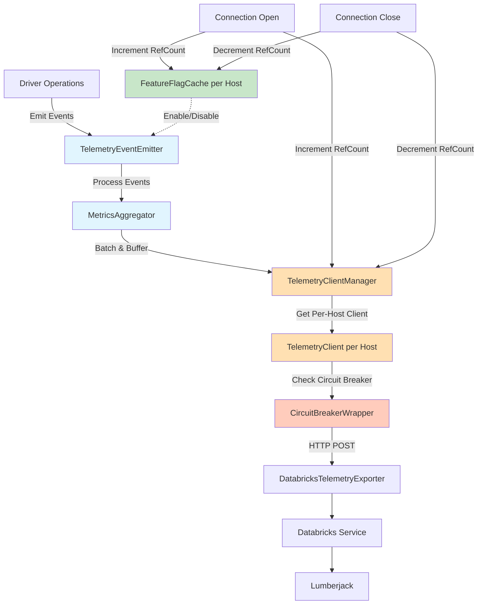
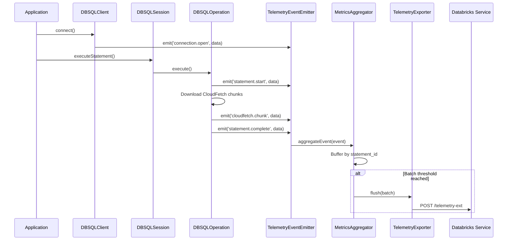
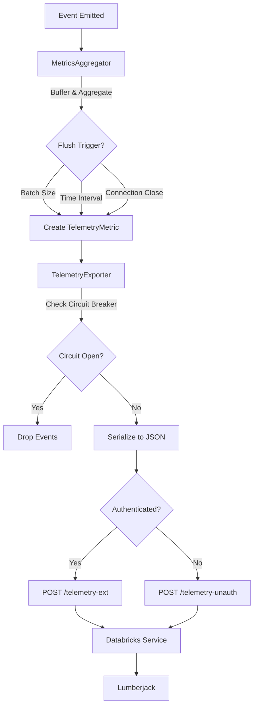
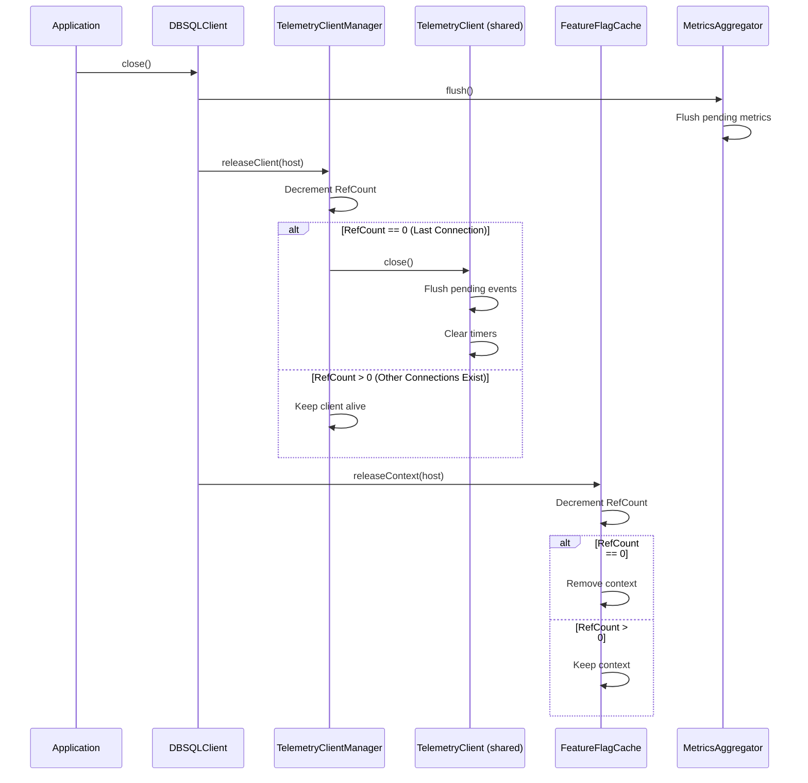

<!--
Copyright (c) 2025 Databricks Contributors

Licensed under the Apache License, Version 2.0 (the "License");
you may not use this file except in compliance with the License.
You may obtain a copy of the License at

        http://www.apache.org/licenses/LICENSE-2.0

Unless required by applicable law or agreed to in writing, software
distributed under the License is distributed on an "AS IS" BASIS,
WITHOUT WARRANTIES OR CONDITIONS OF ANY KIND, either express or implied.
See the License for the specific language governing permissions and
limitations under the License.
-->

# Databricks Node.js SQL Driver: Event-Based Telemetry Design

## Executive Summary

This document outlines an **event-based telemetry design** for the Databricks Node.js SQL driver that leverages Node.js's native EventEmitter infrastructure. The design is inspired by the production-tested patterns from the Databricks JDBC driver and adapted to Node.js idioms.

**Key Objectives:**
- Collect driver usage metrics and export to Databricks telemetry service
- Leverage Node.js EventEmitter for instrumentation
- Maintain server-side feature flag control
- Non-blocking, async operation using Promises
- Privacy-first: No PII or query data collected

**Design Principles:**
- **Event-driven architecture**: Use Node.js EventEmitter pattern
- **Single instrumentation point**: Emit events at key driver operations
- **Non-blocking**: All operations async with Promises
- **Privacy-first**: No PII or query data collected
- **Server-controlled**: Feature flag support for enable/disable

**Production Requirements** (from JDBC driver experience):
- **Feature flag caching**: Per-host caching to avoid rate limiting
- **Circuit breaker**: Protect against telemetry endpoint failures
- **🚨 Exception swallowing**: ALL telemetry exceptions caught and logged at LogLevel.debug ONLY (never warn/error)
- **Per-host telemetry client**: One client per host to prevent rate limiting
- **Graceful shutdown**: Proper cleanup with reference counting
- **Smart exception flushing**: Only flush terminal exceptions immediately

---

## Table of Contents

1. [Background & Motivation](#1-background--motivation)
2. [Architecture Overview](#2-architecture-overview)
3. [Core Components](#3-core-components)
    - 3.1 [FeatureFlagCache (Per-Host)](#31-featureflagcache-per-host)
    - 3.2 [TelemetryClientManager (Per-Host)](#32-telemetryclientmanager-per-host)
    - 3.3 [Circuit Breaker](#33-circuit-breaker)
    - 3.4 [TelemetryEventEmitter](#34-telemetryeventemitter)
    - 3.5 [MetricsAggregator](#35-metricsaggregator)
    - 3.6 [DatabricksTelemetryExporter](#36-databrickstelemetryexporter)
4. [Data Collection](#4-data-collection)
5. [Export Mechanism](#5-export-mechanism)
6. [Configuration](#6-configuration)
7. [Privacy & Compliance](#7-privacy--compliance)
8. [Error Handling](#8-error-handling)
    - 8.1 [Exception Swallowing Strategy](#81-exception-swallowing-strategy)
    - 8.2 [Terminal vs Retryable Exceptions](#82-terminal-vs-retryable-exceptions)
9. [Graceful Shutdown](#9-graceful-shutdown)
10. [Testing Strategy](#10-testing-strategy)
11. [Implementation Checklist](#11-implementation-checklist)
12. [Open Questions](#12-open-questions)
13. [References](#13-references)

---

## 1. Background & Motivation

### 1.1 Current State

The Databricks Node.js SQL driver currently:
- ✅ **DBSQLClient**: Main client class for connection management
- ✅ **DBSQLSession**: Session management with operation tracking
- ✅ **DBSQLOperation**: Statement execution and result handling
- ✅ **EventEmitter**: Built-in Node.js event infrastructure
- ✅ **HttpConnection**: HTTP-based Thrift communication

### 1.2 Design Opportunity

The driver needs comprehensive telemetry to:
- Track driver usage patterns and performance metrics
- Monitor CloudFetch adoption and effectiveness
- Identify performance bottlenecks and optimization opportunities
- Provide data for product decisions and customer support

### 1.3 The Approach

**Event-driven telemetry collection**:
- ✅ Emit telemetry events at key driver operations
- ✅ Aggregate metrics by statement ID
- ✅ Export batched data to Databricks service
- ✅ Maintain correlation between sessions and statements
- ✅ Follow JDBC driver patterns (per-host clients, circuit breaker, etc.)

---

## 2. Architecture Overview

### 2.1 High-Level Architecture



**Key Components:**
1. **TelemetryEventEmitter** (new): Extends EventEmitter, emits events at key operations
2. **FeatureFlagCache** (new): Per-host caching of feature flags with reference counting
3. **TelemetryClientManager** (new): Manages one telemetry client per host with reference counting
4. **CircuitBreakerWrapper** (new): Protects against failing telemetry endpoint
5. **MetricsAggregator** (new): Aggregates by statement, batches events
6. **DatabricksTelemetryExporter** (new): Exports to Databricks service

### 2.2 Event Flow



---

## 3. Core Components

### 3.1 FeatureFlagCache (Per-Host)

**Purpose**: Cache feature flag values at the host level to avoid repeated API calls and rate limiting.

**Location**: `lib/telemetry/FeatureFlagCache.ts`

#### Rationale
- **Per-host caching**: Feature flags cached by host (not per connection) to prevent rate limiting
- **Reference counting**: Tracks number of connections per host for proper cleanup
- **Automatic expiration**: Refreshes cached flags after TTL expires (15 minutes)
- **Thread-safe**: Uses proper locking for concurrent access from multiple connections

#### Interface

```typescript
// lib/telemetry/FeatureFlagCache.ts

import IClientContext from '../contracts/IClientContext';
import { LogLevel } from '../contracts/IDBSQLLogger';

/**
 * Context holding feature flag state for a specific host.
 */
interface FeatureFlagContext {
  telemetryEnabled?: boolean;
  lastFetched?: Date;
  refCount: number;
  cacheDuration: number; // 15 minutes in ms
}

/**
 * Manages feature flag cache per host.
 * Prevents rate limiting by caching feature flag responses.
 * Instance-based, stored in DBSQLClient.
 */
class FeatureFlagCache {
  private contexts: Map<string, FeatureFlagContext>;
  private readonly CACHE_DURATION_MS = 15 * 60 * 1000; // 15 minutes
  private readonly FEATURE_FLAG_NAME = 'databricks.partnerplatform.clientConfigsFeatureFlags.enableTelemetryForNodeJs';

  constructor(private context: IClientContext) {
    this.contexts = new Map();
  }

  /**
   * Gets or creates a feature flag context for the host.
   * Increments reference count.
   */
  getOrCreateContext(host: string): FeatureFlagContext {
    let ctx = this.contexts.get(host);
    if (!ctx) {
      ctx = {
        refCount: 0,
        cacheDuration: this.CACHE_DURATION_MS,
      };
      this.contexts.set(host, ctx);
    }
    ctx.refCount++;
    return ctx;
  }

  /**
   * Decrements reference count for the host.
   * Removes context when ref count reaches zero.
   */
  releaseContext(host: string): void {
    const ctx = this.contexts.get(host);
    if (ctx) {
      ctx.refCount--;
      if (ctx.refCount <= 0) {
        this.contexts.delete(host);
      }
    }
  }

  /**
   * Checks if telemetry is enabled for the host.
   * Uses cached value if available and not expired.
   */
  async isTelemetryEnabled(host: string): Promise<boolean> {
    const logger = this.context.getLogger();
    const ctx = this.contexts.get(host);

    if (!ctx) {
      return false;
    }

    const isExpired = !ctx.lastFetched ||
      (Date.now() - ctx.lastFetched.getTime() > ctx.cacheDuration);

    if (isExpired) {
      try {
        // Fetch feature flag from server
        ctx.telemetryEnabled = await this.fetchFeatureFlag(host);
        ctx.lastFetched = new Date();
      } catch (error: any) {
        // Log at debug level only
        logger.log(LogLevel.debug, `Error fetching feature flag: ${error.message}`);
      }
    }

    return ctx.telemetryEnabled ?? false;
  }

  private async fetchFeatureFlag(host: string): Promise<boolean> {
    const connectionProvider = await this.context.getConnectionProvider();
    // Implementation to fetch feature flag from server using connection provider
    // Returns true if enabled, false otherwise
    return false; // Placeholder
  }
}

export default FeatureFlagCache;
```

**JDBC Reference**: `DatabricksDriverFeatureFlagsContextFactory.java:27` maintains per-compute (host) feature flag contexts with reference counting.

---

### 3.2 TelemetryClientProvider (Per-Host)

**Purpose**: Manage one telemetry client per host to prevent rate limiting from concurrent connections.

**Location**: `lib/telemetry/TelemetryClientProvider.ts`

#### Rationale
- **One client per host**: Large customers open many parallel connections to the same host
- **Prevents rate limiting**: Shared client batches events from all connections
- **Reference counting**: Tracks active connections, only closes client when last connection closes
- **Thread-safe**: Safe for concurrent access from multiple connections

#### Interface

```typescript
// lib/telemetry/TelemetryClientProvider.ts

import IClientContext from '../contracts/IClientContext';
import TelemetryClient from './TelemetryClient';
import { TelemetryConfiguration } from './types';

/**
 * Holds a telemetry client and its reference count.
 */
interface TelemetryClientHolder {
  client: TelemetryClient;
  refCount: number;
}

/**
 * Manages one telemetry client per host.
 * Prevents rate limiting by sharing clients across connections.
 * Instance-based, stored in DBSQLClient.
 */
class TelemetryClientProvider {
  private clients: Map<string, TelemetryClientHolder>;

  constructor(private context: IClientContext) {
    this.clients = new Map();
  }

  /**
   * Gets or creates a telemetry client for the host.
   * Increments reference count.
   */
  getOrCreateClient(host: string): TelemetryClient {
    const config = this.context.getConfig();
    let holder = this.clients.get(host);

    if (!holder) {
      holder = {
        client: new TelemetryClient(this.context, host),
        refCount: 0,
      };
      this.clients.set(host, holder);
    }
    holder.refCount++;
    return holder.client;
  }

  /**
   * Decrements reference count for the host.
   * Closes and removes client when ref count reaches zero.
   */
  async releaseClient(host: string): Promise<void> {
    const holder = this.clients.get(host);
    if (holder) {
      holder.refCount--;
      if (holder.refCount <= 0) {
        await holder.client.close();
        this.clients.delete(host);
      }
    }
  }
}

export default TelemetryClientProvider;
```

**JDBC Reference**: `TelemetryClientFactory.java:27` maintains `ConcurrentHashMap<String, TelemetryClientHolder>` with per-host clients and reference counting.

---

### 3.3 Circuit Breaker

**Purpose**: Implement circuit breaker pattern to protect against failing telemetry endpoint.

**Location**: `lib/telemetry/CircuitBreaker.ts`

#### Rationale
- **Endpoint protection**: The telemetry endpoint itself may fail or become unavailable
- **Not just rate limiting**: Protects against 5xx errors, timeouts, network failures
- **Resource efficiency**: Prevents wasting resources on a failing endpoint
- **Auto-recovery**: Automatically detects when endpoint becomes healthy again

#### States
1. **Closed**: Normal operation, requests pass through
2. **Open**: After threshold failures, all requests rejected immediately (drop events)
3. **Half-Open**: After timeout, allows test requests to check if endpoint recovered

#### Interface

```typescript
// lib/telemetry/CircuitBreaker.ts

enum CircuitBreakerState {
  CLOSED = 'CLOSED',
  OPEN = 'OPEN',
  HALF_OPEN = 'HALF_OPEN',
}

interface CircuitBreakerConfig {
  failureThreshold: number; // Open after N failures
  timeout: number; // Try again after N ms
  successThreshold: number; // Close after N successes
}

/**
 * Circuit breaker for telemetry exporter.
 */
class CircuitBreaker {
  private state: CircuitBreakerState = CircuitBreakerState.CLOSED;
  private failureCount = 0;
  private successCount = 0;
  private nextAttempt?: Date;

  constructor(private config: CircuitBreakerConfig) {}

  async execute<T>(operation: () => Promise<T>): Promise<T> {
    if (this.state === CircuitBreakerState.OPEN) {
      if (this.nextAttempt && Date.now() < this.nextAttempt.getTime()) {
        throw new Error('Circuit breaker OPEN');
      }
      this.state = CircuitBreakerState.HALF_OPEN;
    }

    try {
      const result = await operation();
      this.onSuccess();
      return result;
    } catch (error) {
      this.onFailure();
      throw error;
    }
  }

  private onSuccess(): void {
    this.failureCount = 0;
    if (this.state === CircuitBreakerState.HALF_OPEN) {
      this.successCount++;
      if (this.successCount >= this.config.successThreshold) {
        this.state = CircuitBreakerState.CLOSED;
        this.successCount = 0;
        console.debug('[DEBUG] Circuit breaker CLOSED');
      }
    }
  }

  private onFailure(): void {
    this.failureCount++;
    this.successCount = 0;
    if (this.failureCount >= this.config.failureThreshold) {
      this.state = CircuitBreakerState.OPEN;
      this.nextAttempt = new Date(Date.now() + this.config.timeout);
      console.debug('[DEBUG] Circuit breaker OPEN');
    }
  }
}

/**
 * Manages circuit breakers per host.
 * Instance-based, stored in TelemetryClientProvider.
 */
class CircuitBreakerRegistry {
  private breakers: Map<string, CircuitBreaker>;

  constructor() {
    this.breakers = new Map();
  }

  getCircuitBreaker(host: string): CircuitBreaker {
    let breaker = this.breakers.get(host);
    if (!breaker) {
      breaker = new CircuitBreaker({
        failureThreshold: 5,
        timeout: 60000, // 1 minute
        successThreshold: 2,
      });
      this.breakers.set(host, breaker);
    }
    return breaker;
  }
}

export { CircuitBreaker, CircuitBreakerRegistry, CircuitBreakerState };
```

**JDBC Reference**: `CircuitBreakerTelemetryPushClient.java:15` and `CircuitBreakerManager.java:25`

---

### 3.4 TelemetryEventEmitter

**Purpose**: Emit telemetry events at key driver operations using Node.js EventEmitter.

**Location**: `lib/telemetry/TelemetryEventEmitter.ts`

#### Interface

```typescript
// lib/telemetry/TelemetryEventEmitter.ts

import { EventEmitter } from 'events';
import IClientContext from '../contracts/IClientContext';
import { LogLevel } from '../contracts/IDBSQLLogger';
import { TelemetryEvent } from './types';

/**
 * EventEmitter for driver telemetry.
 * Emits events at key driver operations.
 */
class TelemetryEventEmitter extends EventEmitter {
  private enabled: boolean;

  constructor(private context: IClientContext) {
    super();
    const config = context.getConfig();
    this.enabled = config.telemetryEnabled ?? true;
  }

  /**
   * Emit a connection open event.
   */
  emitConnectionOpen(data: {
    sessionId: string;
    workspaceId: string;
    driverConfig: any;
  }): void {
    if (!this.enabled) return;

    const logger = this.context.getLogger();
    try {
      this.emit('telemetry.connection.open', {
        eventType: 'connection.open',
        timestamp: Date.now(),
        ...data,
      });
    } catch (error: any) {
      // Swallow all exceptions
      logger.log(LogLevel.debug, `Error emitting connection event: ${error.message}`);
    }
  }

  /**
   * Emit a statement start event.
   */
  emitStatementStart(data: {
    statementId: string;
    sessionId: string;
    operationType: string;
  }): void {
    if (!this.enabled) return;

    try {
      this.emit('telemetry.statement.start', {
        eventType: 'statement.start',
        timestamp: Date.now(),
        ...data,
      });
    } catch (error: any) {
      logger.log(LogLevel.debug, `Error emitting statement start: ${error.message}`);
    }
  }

  /**
   * Emit a statement complete event.
   */
  emitStatementComplete(data: {
    statementId: string;
    sessionId: string;
    latencyMs: number;
    resultFormat?: string;
    chunkCount?: number;
    bytesDownloaded?: number;
    pollCount?: number;
  }): void {
    if (!this.enabled) return;

    const logger = this.context.getLogger();
    try {
      this.emit('telemetry.statement.complete', {
        eventType: 'statement.complete',
        timestamp: Date.now(),
        ...data,
      });
    } catch (error: any) {
      logger.log(LogLevel.debug, `Error emitting statement complete: ${error.message}`);
    }
  }

  /**
   * Emit a CloudFetch chunk download event.
   */
  emitCloudFetchChunk(data: {
    statementId: string;
    chunkIndex: number;
    latencyMs: number;
    bytes: number;
    compressed: boolean;
  }): void {
    if (!this.enabled) return;

    const logger = this.context.getLogger();
    try {
      this.emit('telemetry.cloudfetch.chunk', {
        eventType: 'cloudfetch.chunk',
        timestamp: Date.now(),
        ...data,
      });
    } catch (error: any) {
      logger.log(LogLevel.debug, `Error emitting cloudfetch chunk: ${error.message}`);
    }
  }

  /**
   * Emit an error event.
   */
  emitError(data: {
    statementId?: string;
    sessionId?: string;
    errorName: string;
    errorMessage: string;
    isTerminal: boolean;
  }): void {
    if (!this.enabled) return;

    const logger = this.context.getLogger();
    try {
      this.emit('telemetry.error', {
        eventType: 'error',
        timestamp: Date.now(),
        ...data,
      });
    } catch (error: any) {
      logger.log(LogLevel.debug, `Error emitting error event: ${error.message}`);
    }
  }
}

export default TelemetryEventEmitter;
```

---

### 3.5 MetricsAggregator

**Purpose**: Aggregate telemetry events into metrics suitable for Databricks telemetry.

**Location**: `lib/telemetry/MetricsAggregator.ts`

**Key Design**: Aggregates metrics by `statement_id`, with each aggregated event including both `statement_id` and `session_id` for correlation. This follows the JDBC driver pattern.

**JDBC References**:
- `TelemetryCollector.java:29-30` - Per-statement aggregation using `ConcurrentHashMap<String, StatementTelemetryDetails>`
- `TelemetryEvent.java:8-12` - Both `session_id` and `sql_statement_id` fields in exported events

#### Interface

```typescript
// lib/telemetry/MetricsAggregator.ts

import IClientContext from '../contracts/IClientContext';
import { LogLevel } from '../contracts/IDBSQLLogger';
import { TelemetryEvent, TelemetryMetric } from './types';
import DatabricksTelemetryExporter from './DatabricksTelemetryExporter';

/**
 * Aggregated telemetry data for a statement.
 */
interface StatementTelemetryDetails {
  statementId: string;
  sessionId: string;
  operationType?: string;
  startTime: number;
  latencyMs?: number;
  resultFormat?: string;
  chunkCount: number;
  totalBytesDownloaded: number;
  pollCount: number;
  pollLatencyMs: number;
  exceptions: Error[];
}

/**
 * Aggregates metrics from events by statement_id and includes session_id.
 * Follows JDBC driver pattern: aggregation by statement, export with both IDs.
 */
class MetricsAggregator {
  private statements: Map<string, StatementTelemetryDetails>;
  private batch: TelemetryMetric[];
  private flushTimer?: NodeJS.Timeout;

  constructor(
    private context: IClientContext,
    private exporter: DatabricksTelemetryExporter
  ) {
    this.statements = new Map();
    this.batch = [];
    this.startPeriodicFlush();
  }

  /**
   * Process a telemetry event.
   */
  processEvent(event: TelemetryEvent): void {
    try {
      switch (event.eventType) {
        case 'connection.open':
          this.handleConnectionOpen(event);
          break;
        case 'statement.start':
          this.handleStatementStart(event);
          break;
        case 'statement.complete':
          this.handleStatementComplete(event);
          break;
        case 'cloudfetch.chunk':
          this.handleCloudFetchChunk(event);
          break;
        case 'error':
          this.handleError(event);
          break;
      }
    } catch (error: any) {
      const logger = this.context.getLogger();
      logger.log(LogLevel.debug, `Error processing event: ${error.message}`);
    }
  }

  /**
   * Mark statement complete and emit aggregated metrics.
   */
  completeStatement(statementId: string, failed: boolean = false): void {
    const logger = this.context.getLogger();
    try {
      const details = this.statements.get(statementId);
      if (!details) return;

      // Create aggregated metric
      const metric: TelemetryMetric = {
        metricType: 'statement',
        timestamp: details.startTime,
        sessionId: details.sessionId,
        statementId: details.statementId,
        latencyMs: details.latencyMs,
        resultFormat: details.resultFormat,
        chunkCount: details.chunkCount,
        bytesDownloaded: details.totalBytesDownloaded,
        pollCount: details.pollCount,
      };

      this.addToBatch(metric);

      // Only flush exceptions if statement failed
      if (failed && details.exceptions.length > 0) {
        for (const error of details.exceptions) {
          this.emitErrorMetric(statementId, details.sessionId, error);
        }
      }

      this.statements.delete(statementId);
    } catch (error: any) {
      logger.log(LogLevel.debug, `Error completing statement: ${error.message}`);
    }
  }

  /**
   * Flush all pending metrics.
   */
  async flush(): Promise<void> {
    const logger = this.context.getLogger();
    try {
      if (this.batch.length > 0) {
        const toFlush = [...this.batch];
        this.batch = [];
        await this.exporter.export(toFlush);
      }
    } catch (error: any) {
      logger.log(LogLevel.debug, `Error flushing metrics: ${error.message}`);
    }
  }

  /**
   * Close the aggregator and flush pending metrics.
   */
  async close(): Promise<void> {
    if (this.flushTimer) {
      clearInterval(this.flushTimer);
    }
    await this.flush();
  }

  private handleConnectionOpen(event: TelemetryEvent): void {
    // Connection events are emitted immediately (no aggregation)
    const metric: TelemetryMetric = {
      metricType: 'connection',
      timestamp: event.timestamp,
      sessionId: event.sessionId,
      driverConfig: event.driverConfig,
    };
    this.addToBatch(metric);
  }

  private handleStatementStart(event: TelemetryEvent): void {
    // Create new statement context for aggregation
    this.statements.set(event.statementId!, {
      statementId: event.statementId!,
      sessionId: event.sessionId!,
      operationType: event.operationType,
      startTime: event.timestamp,
      chunkCount: 0,
      totalBytesDownloaded: 0,
      pollCount: 0,
      pollLatencyMs: 0,
      exceptions: [],
    });
  }

  private handleStatementComplete(event: TelemetryEvent): void {
    const details = this.statements.get(event.statementId!);
    if (details) {
      details.latencyMs = event.latencyMs;
      details.resultFormat = event.resultFormat;
      details.pollCount = event.pollCount || 0;
    }
  }

  private handleCloudFetchChunk(event: TelemetryEvent): void {
    const details = this.statements.get(event.statementId!);
    if (details) {
      details.chunkCount++;
      details.totalBytesDownloaded += event.bytes || 0;
    }
  }

  private handleError(event: TelemetryEvent): void {
    if (event.isTerminal) {
      // Terminal exceptions: flush immediately
      this.emitErrorMetric(
        event.statementId || '',
        event.sessionId || '',
        new Error(event.errorMessage)
      );
    } else {
      // Retryable exceptions: buffer until statement completes
      const details = this.statements.get(event.statementId!);
      if (details) {
        details.exceptions.push(new Error(event.errorMessage));
      }
    }
  }

  private emitErrorMetric(statementId: string, sessionId: string, error: Error): void {
    const metric: TelemetryMetric = {
      metricType: 'error',
      timestamp: Date.now(),
      statementId,
      sessionId,
      errorName: error.name,
      errorMessage: error.message,
    };
    this.addToBatch(metric);
  }

  private addToBatch(metric: TelemetryMetric): void {
    const config = this.context.getConfig();
    const logger = this.context.getLogger();

    this.batch.push(metric);
    if (this.batch.length >= (config.telemetryBatchSize ?? 100)) {
      // Fire and forget - don't block on flush
      this.flush().catch(error => {
        logger.log(LogLevel.debug, `Error in batch flush: ${error.message}`);
      });
    }
  }

  private startPeriodicFlush(): void {
    const config = this.context.getConfig();
    const logger = this.context.getLogger();

    this.flushTimer = setInterval(() => {
      this.flush().catch(error => {
        logger.log(LogLevel.debug, `Error in periodic flush: ${error.message}`);
      });
    }, config.telemetryFlushIntervalMs ?? 5000);
  }
}

export default MetricsAggregator;
```

---

### 3.6 DatabricksTelemetryExporter

**Purpose**: Export aggregated metrics to Databricks telemetry service.

**Location**: `lib/telemetry/DatabricksTelemetryExporter.ts`

#### Interface

```typescript
// lib/telemetry/DatabricksTelemetryExporter.ts

import IClientContext from '../contracts/IClientContext';
import { LogLevel } from '../contracts/IDBSQLLogger';
import { TelemetryMetric } from './types';
import { CircuitBreakerRegistry } from './CircuitBreaker';
import fetch from 'node-fetch';

/**
 * Exports telemetry metrics to Databricks service.
 */
class DatabricksTelemetryExporter {
  private circuitBreaker;

  constructor(
    private context: IClientContext,
    private host: string,
    private circuitBreakerRegistry: CircuitBreakerRegistry
  ) {
    this.circuitBreaker = circuitBreakerRegistry.getCircuitBreaker(host);
  }

  /**
   * Export metrics to Databricks service. Never throws.
   */
  async export(metrics: TelemetryMetric[]): Promise<void> {
    if (metrics.length === 0) return;

    const logger = this.context.getLogger();

    try {
      await this.circuitBreaker.execute(async () => {
        await this.exportInternal(metrics);
      });
    } catch (error: any) {
      if (error.message === 'Circuit breaker OPEN') {
        logger.log(LogLevel.debug, 'Circuit breaker OPEN - dropping telemetry');
      } else {
        logger.log(LogLevel.debug, `Telemetry export error: ${error.message}`);
      }
    }
  }

  private async exportInternal(metrics: TelemetryMetric[]): Promise<void> {
    const config = this.context.getConfig();
    const connectionProvider = await this.context.getConnectionProvider();

    const endpoint = config.telemetryAuthenticatedExport
      ? `https://${this.host}/api/2.0/sql/telemetry-ext`
      : `https://${this.host}/api/2.0/sql/telemetry-unauth`;

    const payload = {
      frontend_logs: metrics.map(m => this.toTelemetryLog(m)),
    };

    const response = await fetch(endpoint, {
      method: 'POST',
      headers: {
        'Content-Type': 'application/json',
        // Use connection provider's auth headers
      },
      body: JSON.stringify(payload),
    });

    if (!response.ok) {
      throw new Error(`Telemetry export failed: ${response.status}`);
    }
  }

  private toTelemetryLog(metric: TelemetryMetric): any {
    return {
      workspace_id: metric.workspaceId,
      frontend_log_event_id: this.generateUUID(),
      context: {
        client_context: {
          timestamp_millis: metric.timestamp,
          user_agent: this.httpClient.userAgent,
        },
      },
      entry: {
        sql_driver_log: {
          session_id: metric.sessionId,
          sql_statement_id: metric.statementId,
          operation_latency_ms: metric.latencyMs,
          sql_operation: {
            execution_result_format: metric.resultFormat,
            chunk_details: metric.chunkCount ? {
              chunk_count: metric.chunkCount,
              total_bytes: metric.bytesDownloaded,
            } : undefined,
          },
          error_info: metric.errorName ? {
            error_name: metric.errorName,
            stack_trace: metric.errorMessage,
          } : undefined,
        },
      },
    };
  }

  private generateUUID(): string {
    return 'xxxxxxxx-xxxx-4xxx-yxxx-xxxxxxxxxxxx'.replace(/[xy]/g, (c) => {
      const r = Math.random() * 16 | 0;
      const v = c === 'x' ? r : (r & 0x3 | 0x8);
      return v.toString(16);
    });
  }
}

export default DatabricksTelemetryExporter;
```

---

## 4. Data Collection

### 4.1 Telemetry Events

The driver emits events at key operations:

| Event | When | Data Collected |
|-------|------|----------------|
| `connection.open` | Connection established | session_id, workspace_id, driver config |
| `statement.start` | Statement execution begins | statement_id, session_id, operation_type |
| `statement.complete` | Statement execution ends | statement_id, latency, result_format, poll_count |
| `cloudfetch.chunk` | CloudFetch chunk downloaded | statement_id, chunk_index, latency, bytes |
| `error` | Error occurs | statement_id, error_name, error_message, is_terminal |

### 4.2 Driver Configuration Data

Collected once per connection:

```typescript
interface DriverConfiguration {
  driverVersion: string;
  driverName: string;
  nodeVersion: string;
  platform: string;
  osVersion: string;

  // Feature flags
  cloudFetchEnabled: boolean;
  lz4Enabled: boolean;
  arrowEnabled: boolean;
  directResultsEnabled: boolean;

  // Configuration values
  socketTimeout: number;
  retryMaxAttempts: number;
  cloudFetchConcurrentDownloads: number;
}
```

### 4.3 Statement Metrics

Aggregated per statement:

```typescript
interface StatementMetrics {
  statementId: string;
  sessionId: string;
  operationType: string;

  // Latency
  executionLatencyMs: number;
  pollCount: number;
  pollLatencyMs: number;

  // Result format
  resultFormat: 'inline' | 'cloudfetch' | 'arrow';

  // CloudFetch metrics
  chunkCount?: number;
  totalBytesDownloaded?: number;
  compressionEnabled?: boolean;
}
```

### 4.4 Privacy Considerations

**Never Collected**:
- ❌ SQL query text
- ❌ Query results or data values
- ❌ Table/column names
- ❌ User identities (only workspace ID)
- ❌ Credentials or tokens

**Always Collected**:
- ✅ Operation latency
- ✅ Error codes and types
- ✅ Feature flags (boolean settings)
- ✅ Statement/session IDs (UUIDs)
- ✅ Aggregated metrics (counts, sizes)

---

## 5. Export Mechanism

### 5.1 Export Flow



### 5.2 Batching Strategy

- **Batch size**: Default 100 metrics
- **Flush interval**: Default 5 seconds
- **Force flush**: On connection close
- **Background flushing**: Non-blocking with setInterval

### 5.3 Retry Strategy

- **Retryable errors**: 429, 500, 502, 503, 504, network timeouts
- **Terminal errors**: 400, 401, 403, 404
- **Max retries**: 3 attempts
- **Backoff**: Exponential with jitter (100ms - 1000ms)
- **Circuit breaker**: Opens after 5 consecutive failures

---

## 6. Configuration

### 6.1 Configuration Model

```typescript
// lib/telemetry/types.ts

export interface TelemetryEvent {
  eventType: string;
  timestamp: number;
  sessionId?: string;
  statementId?: string;
  // ... other event-specific fields
}

export interface TelemetryMetric {
  metricType: string;
  timestamp: number;
  sessionId?: string;
  statementId?: string;
  // ... other metric fields
}
```

### 6.2 Client Configuration

Telemetry configuration is added to `ClientConfig` (not `ClientOptions`), following the existing pattern for `useCloudFetch`, `useLZ4Compression`, etc.

```typescript
// lib/contracts/IClientContext.ts

export interface ClientConfig {
  // ... existing fields

  useLZ4Compression: boolean;
  enableMetricViewMetadata?: boolean;

  // Telemetry configuration
  telemetryEnabled?: boolean;
  telemetryBatchSize?: number;
  telemetryFlushIntervalMs?: number;
  telemetryMaxRetries?: number;
  telemetryAuthenticatedExport?: boolean;
  telemetryCircuitBreakerThreshold?: number;
  telemetryCircuitBreakerTimeout?: number;
}
```

Configuration can be overridden via `ConnectionOptions`:

```typescript
// lib/contracts/IDBSQLClient.ts

export type ConnectionOptions = {
  host: string;
  // ... existing fields

  // Optional telemetry overrides
  telemetryEnabled?: boolean;
} & AuthOptions;
```

### 6.3 Initialization

```typescript
// In DBSQLClient.ts

import FeatureFlagCache from './telemetry/FeatureFlagCache';
import TelemetryClientProvider from './telemetry/TelemetryClientProvider';
import TelemetryEventEmitter from './telemetry/TelemetryEventEmitter';
import MetricsAggregator from './telemetry/MetricsAggregator';
import DatabricksTelemetryExporter from './telemetry/DatabricksTelemetryExporter';
import { CircuitBreakerRegistry } from './telemetry/CircuitBreaker';

export default class DBSQLClient extends EventEmitter implements IDBSQLClient, IClientContext {
  // ... existing fields

  // Telemetry components (instances, not singletons)
  private featureFlagCache?: FeatureFlagCache;
  private telemetryClientProvider?: TelemetryClientProvider;
  private telemetryEmitter?: TelemetryEventEmitter;
  private telemetryAggregator?: MetricsAggregator;
  private host?: string;

  private static getDefaultConfig(): ClientConfig {
    return {
      // ... existing config

      // Telemetry defaults
      telemetryEnabled: false, // Initially disabled for safe rollout
      telemetryBatchSize: 100,
      telemetryFlushIntervalMs: 5000,
      telemetryMaxRetries: 3,
      telemetryAuthenticatedExport: true,
      telemetryCircuitBreakerThreshold: 5,
      telemetryCircuitBreakerTimeout: 60000,
    };
  }

  async connect(options: ConnectionOptions): Promise<IDBSQLClient> {
    // ... existing connection logic

    // Store host for telemetry
    this.host = options.host;

    // Override telemetry config if provided in options
    if (options.telemetryEnabled !== undefined) {
      this.config.telemetryEnabled = options.telemetryEnabled;
    }

    // Initialize telemetry if enabled
    if (this.config.telemetryEnabled) {
      await this.initializeTelemetry();
    }

    return this;
  }

  private async initializeTelemetry(): Promise<void> {
    if (!this.host) return;

    try {
      // Create feature flag cache instance
      this.featureFlagCache = new FeatureFlagCache(this);
      this.featureFlagCache.getOrCreateContext(this.host);

      // Check if telemetry enabled via feature flag
      const enabled = await this.featureFlagCache.isTelemetryEnabled(this.host);
      if (!enabled) {
        this.logger.log(LogLevel.debug, 'Telemetry disabled via feature flag');
        return;
      }

      // Create telemetry components (all instance-based)
      this.telemetryClientProvider = new TelemetryClientProvider(this);
      this.telemetryEmitter = new TelemetryEventEmitter(this);

      const circuitBreakerRegistry = new CircuitBreakerRegistry();
      const exporter = new DatabricksTelemetryExporter(this, this.host, circuitBreakerRegistry);
      this.telemetryAggregator = new MetricsAggregator(this, exporter);

      // Wire up event listeners
      this.telemetryEmitter.on('telemetry.connection.open', (event) => {
        this.telemetryAggregator?.processEvent(event);
      });

      this.telemetryEmitter.on('telemetry.statement.start', (event) => {
        this.telemetryAggregator?.processEvent(event);
      });

      this.telemetryEmitter.on('telemetry.statement.complete', (event) => {
        this.telemetryAggregator?.processEvent(event);
      });

      this.telemetryEmitter.on('telemetry.cloudfetch.chunk', (event) => {
        this.telemetryAggregator?.processEvent(event);
      });

      this.telemetryEmitter.on('telemetry.error', (event) => {
        this.telemetryAggregator?.processEvent(event);
      });

      this.logger.log(LogLevel.info, 'Telemetry initialized');
    } catch (error: any) {
      // Swallow all telemetry initialization errors
      this.logger.log(LogLevel.debug, `Telemetry initialization failed: ${error.message}`);
    }
  }

  async close(): Promise<void> {
    // Cleanup telemetry
    if (this.host) {
      try {
        // Flush pending metrics
        if (this.telemetryAggregator) {
          await this.telemetryAggregator.flush();
        }

        // Release telemetry client
        if (this.telemetryClientProvider) {
          await this.telemetryClientProvider.releaseClient(this.host);
        }

        // Release feature flag context
        if (this.featureFlagCache) {
          this.featureFlagCache.releaseContext(this.host);
        }
      } catch (error: any) {
        this.logger.log(LogLevel.debug, `Telemetry cleanup error: ${error.message}`);
      }
    }

    // ... existing close logic
  }
}
```

---

## 7. Privacy & Compliance

### 7.1 Data Privacy

**Never Collected**:
- ❌ SQL query text (only statement ID)
- ❌ Query results or data values
- ❌ Table/column names from queries
- ❌ User identities (only workspace ID)
- ❌ Credentials or authentication tokens

**Always Collected**:
- ✅ Operation latency
- ✅ Error codes (not full stack traces with PII)
- ✅ Feature flags (boolean settings)
- ✅ Statement/session IDs (UUIDs)
- ✅ Aggregated metrics (counts, bytes)

### 7.2 Compliance

- **GDPR**: No personal data collected
- **CCPA**: No personal information
- **SOC 2**: All data encrypted in transit (HTTPS)
- **Data Residency**: Uses regional control plane

---

## 8. Error Handling

### 8.1 Exception Swallowing Strategy

**Core Principle**: Every telemetry exception must be swallowed with minimal logging to avoid customer anxiety.

**Rationale** (from JDBC experience):
- Customers become anxious when they see error logs, even if telemetry is non-blocking
- Telemetry failures should never impact the driver's core functionality
- **Critical**: Circuit breaker must catch errors **before** swallowing

#### Logging Levels
- **TRACE** (console.debug): Use for most telemetry errors (default)
- **DEBUG** (console.debug): Use only for circuit breaker state changes
- **WARN/ERROR**: Never use for telemetry errors

#### Exception Handling Pattern

```typescript
// All telemetry operations wrapped in try-catch

try {
  // Telemetry operation
  this.telemetryEmitter.emitStatementComplete({ ... });
} catch (error) {
  // Swallow ALL exceptions
  console.debug('[TRACE] Telemetry error:', error);
}
```

### 8.2 Terminal vs Retryable Exceptions

**Requirement**: Do not flush exceptions immediately when they occur. Flush immediately only for **terminal exceptions**.

#### Exception Classification

**Terminal Exceptions** (flush immediately):
- Authentication failures (401, 403)
- Invalid SQL syntax errors
- Permission denied errors
- Resource not found errors (404)
- Invalid request format errors (400)

**Retryable Exceptions** (buffer until statement completes):
- Network timeouts
- Connection errors
- Rate limiting (429)
- Service unavailable (503)
- Internal server errors (500, 502, 504)

#### Exception Classifier

```typescript
// lib/telemetry/ExceptionClassifier.ts

class ExceptionClassifier {
  static isTerminal(error: Error): boolean {
    // Check error type and HTTP status codes
    if (error.name === 'AuthenticationError') return true;
    if (error.name === 'StatusError') {
      const statusCode = (error as any).statusCode;
      return statusCode === 400 || statusCode === 401 ||
             statusCode === 403 || statusCode === 404;
    }
    return false;
  }

  static isRetryable(error: Error): boolean {
    if (error.name === 'StatusError') {
      const statusCode = (error as any).statusCode;
      return statusCode === 429 || statusCode === 500 ||
             statusCode === 502 || statusCode === 503 ||
             statusCode === 504;
    }
    if (error.name === 'RetryError') return true;
    return false;
  }
}

export default ExceptionClassifier;
```

---

## 9. Graceful Shutdown

**Requirement**: Every telemetry client must be closed gracefully. Maintain reference counting properly to determine when to close shared resources.

### 9.1 Shutdown Sequence



### 9.2 Connection Close Implementation

```typescript
// In DBSQLClient.ts

async close(): Promise<void> {
  if (!this.host) return;

  try {
    // Step 1: Flush any pending metrics
    if (this.telemetryAggregator) {
      await this.telemetryAggregator.flush();
    }

    // Step 2: Release telemetry client (decrements ref count, closes if last)
    await TelemetryClientManager.getInstance().releaseClient(this.host);

    // Step 3: Release feature flag context (decrements ref count)
    FeatureFlagCache.getInstance().releaseContext(this.host);
  } catch (error) {
    // Swallow all exceptions per requirement
    console.debug('[TRACE] Error during telemetry cleanup:', error);
  }

  // Continue with normal connection cleanup
  await this.driver.close();
}
```

### 9.3 TelemetryClient Close Implementation

```typescript
// In TelemetryClient.ts

class TelemetryClient {
  private flushTimer?: NodeJS.Timeout;

  async close(): Promise<void> {
    try {
      // Step 1: Clear flush timer
      if (this.flushTimer) {
        clearInterval(this.flushTimer);
        this.flushTimer = undefined;
      }

      // Step 2: Flush all pending metrics synchronously
      await this.aggregator.flush();
    } catch (error) {
      // Swallow per requirement
      console.debug('[TRACE] Error closing telemetry client:', error);
    }
  }
}
```

---

## 10. Testing Strategy

### 10.1 Unit Tests

**TelemetryEventEmitter Tests**:
- `emitter_emits_connection_open_event`
- `emitter_emits_statement_events`
- `emitter_swallows_exceptions`
- `emitter_respects_enabled_flag`

**MetricsAggregator Tests**:
- `aggregator_combines_events_by_statement_id`
- `aggregator_emits_on_statement_complete`
- `aggregator_handles_connection_event`
- `aggregator_flushes_on_batch_size`
- `aggregator_flushes_on_time_interval`
- `aggregator_buffers_retryable_exceptions`
- `aggregator_flushes_terminal_immediately`

**CircuitBreaker Tests**:
- `circuit_breaker_opens_after_failures`
- `circuit_breaker_closes_after_successes`
- `circuit_breaker_per_host_isolation`

**FeatureFlagCache Tests**:
- `cache_caches_per_host`
- `cache_expires_after_15_minutes`
- `cache_ref_counting_works`

**TelemetryClientManager Tests**:
- `manager_one_client_per_host`
- `manager_ref_counting_works`
- `manager_closes_on_last_release`

**ExceptionClassifier Tests**:
- `classifier_identifies_terminal`
- `classifier_identifies_retryable`

### 10.2 Integration Tests

**End-to-End Tests**:
- `e2e_connection_open_exported_successfully`
- `e2e_statement_with_chunks_aggregated_correctly`
- `e2e_error_captured_in_metrics`
- `e2e_feature_flag_disabled_no_export`
- `e2e_multiple_connections_share_client`
- `e2e_circuit_breaker_stops_flushing_when_open`
- `e2e_graceful_shutdown_last_connection_closes_client`
- `e2e_terminal_exception_flushed_immediately`
- `e2e_retryable_exception_buffered_until_complete`

### 10.3 Performance Tests

**Overhead Measurement**:
- `telemetry_overhead_less_than_1_percent`
- `event_emission_completes_under_one_microsecond`

Compare:
- Baseline: Driver without telemetry
- With telemetry disabled: Should be ~0% overhead
- With telemetry enabled: Should be < 1% overhead

---

## 11. Implementation Checklist

### Phase 1: Feature Flag Cache & Per-Host Management
- [ ] Create `FeatureFlagCache` singleton with per-host contexts
- [ ] Implement reference counting
- [ ] Add cache expiration logic (15 minute TTL)
- [ ] Implement feature flag fetch from server
- [ ] Create `TelemetryClientManager` singleton
- [ ] Implement `TelemetryClientHolder` with reference counting
- [ ] Add unit tests

### Phase 2: Circuit Breaker
- [ ] Create `CircuitBreaker` class with state machine
- [ ] Create `CircuitBreakerManager` singleton (per-host breakers)
- [ ] Configure failure thresholds and timeouts
- [ ] Add DEBUG logging for state transitions
- [ ] Add unit tests

### Phase 3: Exception Handling
- [ ] Create `ExceptionClassifier` for terminal vs retryable
- [ ] Update `MetricsAggregator` to buffer retryable exceptions
- [ ] Implement immediate flush for terminal exceptions
- [ ] Wrap all telemetry code in try-catch blocks
- [ ] Replace all logging with TRACE/DEBUG levels only
- [ ] Ensure circuit breaker sees exceptions before swallowing
- [ ] Add unit tests

### Phase 4: Core Implementation
- [ ] Create `TelemetryEventEmitter` class
- [ ] Create `MetricsAggregator` class (with exception buffering)
- [ ] Create `DatabricksTelemetryExporter` class
- [ ] Create telemetry types (`types.ts`)
- [ ] Add event emission points to driver operations

### Phase 5: Integration
- [ ] Update `DBSQLClient.connect()` to use managers
- [ ] Implement graceful shutdown in `DBSQLClient.close()`
- [ ] Add configuration parsing from client options
- [ ] Wire up feature flag cache

### Phase 6: Instrumentation
- [ ] Add `connection.open` event emission
- [ ] Add `statement.start/complete` event emission
- [ ] Add `cloudfetch.chunk` event emission
- [ ] Add error event emission
- [ ] Test end-to-end flow

### Phase 7: Testing
- [ ] Unit tests for all new components
- [ ] Integration tests for per-host management
- [ ] Integration tests for circuit breaker
- [ ] Integration tests for graceful shutdown
- [ ] Performance tests (overhead measurement)
- [ ] Load tests with many concurrent connections

### Phase 8: Documentation
- [ ] Update README with telemetry configuration
- [ ] Document event types and data collected
- [ ] Add troubleshooting guide
- [ ] Update API documentation

---

## 12. Open Questions

### 12.1 Event Naming Conventions

**Question**: Should we use a specific naming convention for telemetry events?

**Recommendation**: Use dot-notation with namespace prefix:
- `telemetry.connection.open`
- `telemetry.statement.start`
- `telemetry.statement.complete`
- `telemetry.cloudfetch.chunk`
- `telemetry.error`

### 12.2 Statement Completion Detection

**Question**: How do we know when a statement is complete for aggregation?

**Options**:
1. **Explicit marker**: Call `completeStatement(id)` explicitly (recommended)
2. **Timeout-based**: Emit after N seconds of inactivity
3. **On close**: When operation is closed

**Recommendation**: Use explicit marker for better control.

### 12.3 TypeScript Types

**Question**: Should we use strict TypeScript types for all telemetry interfaces?

**Answer**: Yes, use strict types to prevent errors and improve maintainability.

---

## 13. References

### 13.1 Related Documentation

- [Node.js EventEmitter](https://nodejs.org/api/events.html)
- [Node.js Timers](https://nodejs.org/api/timers.html)
- [Databricks SQL Connector](https://docs.databricks.com/dev-tools/node-sql-driver.html)

### 13.2 Existing Code References

**JDBC Driver** (reference implementation):
- `TelemetryClient.java:15`: Main telemetry client with batching and flush
- `TelemetryClientFactory.java:27`: Per-host client management with reference counting
- `CircuitBreakerTelemetryPushClient.java:15`: Circuit breaker wrapper
- `TelemetryHelper.java:60-71`: Feature flag checking
- `DatabricksDriverFeatureFlagsContextFactory.java:27`: Per-host feature flag cache
- `TelemetryCollector.java:29-30`: Per-statement aggregation
- `TelemetryEvent.java:8-12`: Both session_id and sql_statement_id in exported events

---

## Summary

This **event-based telemetry design** provides an efficient approach to collecting driver metrics by:

1. **Leveraging Node.js patterns**: Uses native EventEmitter for instrumentation
2. **Following JDBC patterns**: Per-host clients, circuit breaker, feature flag caching
3. **Non-blocking operation**: All telemetry operations async and fire-and-forget
4. **Privacy-first**: No PII or query data collected
5. **Production-ready**: Exception swallowing, graceful shutdown, reference counting

**Key Aggregation Pattern** (following JDBC):
- **Aggregate by `statement_id`**: Multiple events for the same statement are aggregated together
- **Include `session_id` in exports**: Each exported event contains both `statement_id` and `session_id`
- **Enable multi-level correlation**: Allows correlation at both statement and session levels

This design enables the Databricks Node.js SQL driver to collect valuable usage metrics while maintaining code simplicity, high performance, and compatibility with Node.js ecosystem.
