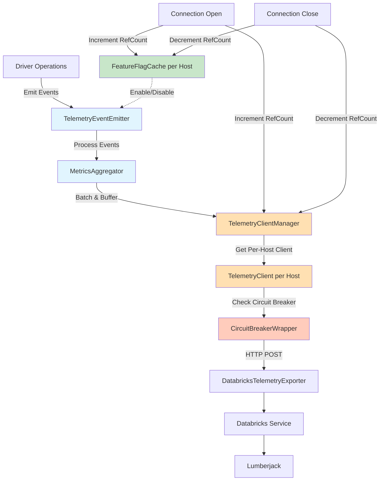
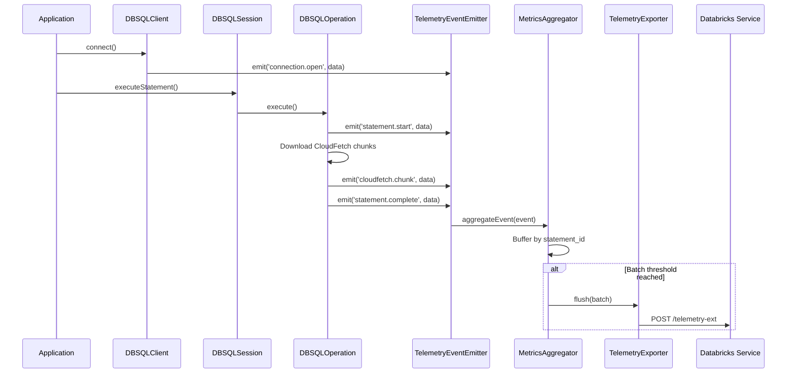
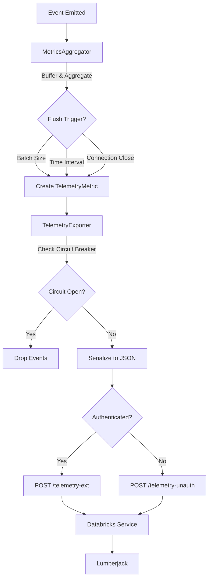
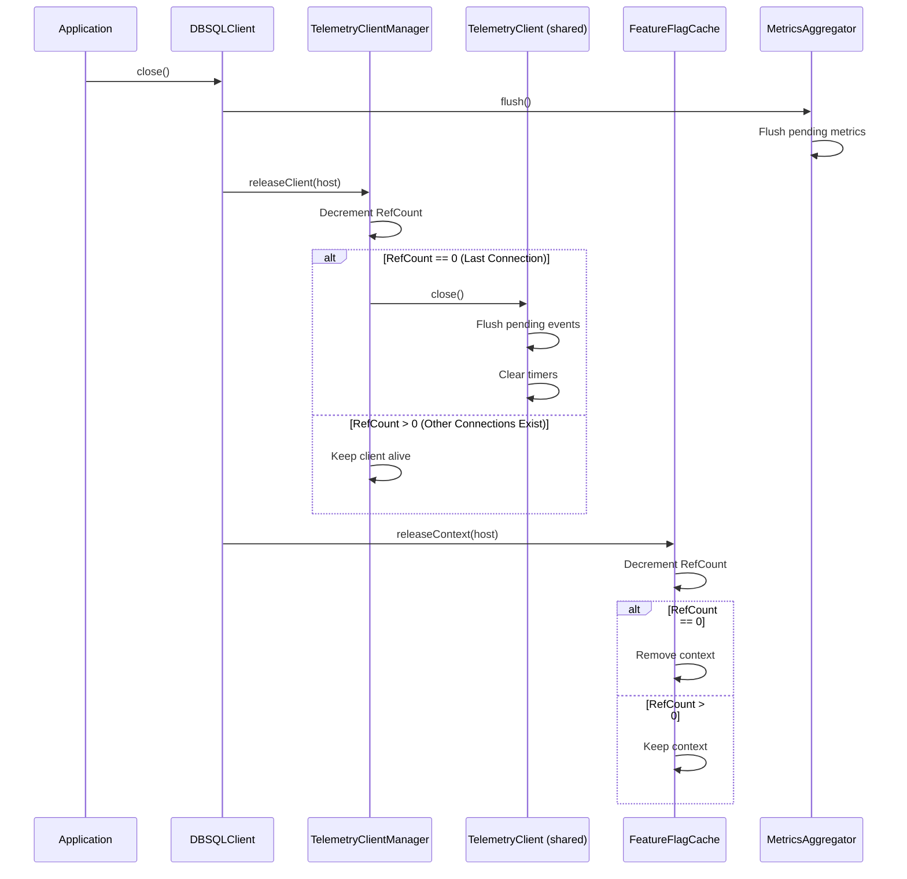

<!--
Copyright (c) 2025 Databricks Contributors

Licensed under the Apache License, Version 2.0 (the "License");
you may not use this file except in compliance with the License.
You may obtain a copy of the License at

        http://www.apache.org/licenses/LICENSE-2.0

Unless required by applicable law or agreed to in writing, software
distributed under the License is distributed on an "AS IS" BASIS,
WITHOUT WARRANTIES OR CONDITIONS OF ANY KIND, either express or implied.
See the License for the specific language governing permissions and
limitations under the License.
-->

# Databricks Node.js SQL Driver: Event-Based Telemetry Design

## Executive Summary

This document outlines an **event-based telemetry design** for the Databricks Node.js SQL driver that leverages Node.js's native EventEmitter infrastructure. The design is inspired by the production-tested patterns from the Databricks JDBC driver and adapted to Node.js idioms.

**Key Objectives:**
- Collect driver usage metrics and export to Databricks telemetry service
- Leverage Node.js EventEmitter for instrumentation
- Maintain server-side feature flag control
- Non-blocking, async operation using Promises
- Privacy-first: No PII or query data collected

**Design Principles:**
- **Event-driven architecture**: Use Node.js EventEmitter pattern
- **Single instrumentation point**: Emit events at key driver operations
- **Non-blocking**: All operations async with Promises
- **Privacy-first**: No PII or query data collected
- **Server-controlled**: Feature flag support for enable/disable

**Production Requirements** (from JDBC driver experience):
- **Feature flag caching**: Per-host caching to avoid rate limiting
- **Circuit breaker**: Protect against telemetry endpoint failures
- **🚨 Exception swallowing**: ALL telemetry exceptions caught and logged at LogLevel.debug ONLY (never warn/error)
- **Per-host telemetry client**: One client per host to prevent rate limiting
- **Graceful shutdown**: Proper cleanup with reference counting
- **Smart exception flushing**: Only flush terminal exceptions immediately

---

## Table of Contents

1. [Background & Motivation](#1-background--motivation)
2. [Architecture Overview](#2-architecture-overview)
3. [Core Components](#3-core-components)
    - 3.1 [FeatureFlagCache (Per-Host)](#31-featureflagcache-per-host)
    - 3.2 [TelemetryClientManager (Per-Host)](#32-telemetryclientmanager-per-host)
    - 3.3 [Circuit Breaker](#33-circuit-breaker)
    - 3.4 [TelemetryEventEmitter](#34-telemetryeventemitter)
    - 3.5 [MetricsAggregator](#35-metricsaggregator)
    - 3.6 [DatabricksTelemetryExporter](#36-databrickstelemetryexporter)
4. [Data Collection](#4-data-collection)
5. [Export Mechanism](#5-export-mechanism)
6. [Configuration](#6-configuration)
7. [Privacy & Compliance](#7-privacy--compliance)
8. [Error Handling](#8-error-handling)
    - 8.1 [Exception Swallowing Strategy](#81-exception-swallowing-strategy)
    - 8.2 [Terminal vs Retryable Exceptions](#82-terminal-vs-retryable-exceptions)
9. [Graceful Shutdown](#9-graceful-shutdown)
10. [Testing Strategy](#10-testing-strategy)
11. [Implementation Checklist](#11-implementation-checklist)
12. [Open Questions](#12-open-questions)
13. [References](#13-references)

---

## 1. Background & Motivation

### 1.1 Current State

The Databricks Node.js SQL driver currently:
- ✅ **DBSQLClient**: Main client class for connection management
- ✅ **DBSQLSession**: Session management with operation tracking
- ✅ **DBSQLOperation**: Statement execution and result handling
- ✅ **EventEmitter**: Built-in Node.js event infrastructure
- ✅ **HttpConnection**: HTTP-based Thrift communication

### 1.2 Design Opportunity

The driver needs comprehensive telemetry to:
- Track driver usage patterns and performance metrics
- Monitor CloudFetch adoption and effectiveness
- Identify performance bottlenecks and optimization opportunities
- Provide data for product decisions and customer support

### 1.3 The Approach

**Event-driven telemetry collection**:
- ✅ Emit telemetry events at key driver operations
- ✅ Aggregate metrics by statement ID
- ✅ Export batched data to Databricks service
- ✅ Maintain correlation between sessions and statements
- ✅ Follow JDBC driver patterns (per-host clients, circuit breaker, etc.)

---

## 2. Architecture Overview

### 2.1 High-Level Architecture



**Key Components:**
1. **TelemetryEventEmitter** (new): Extends EventEmitter, emits events at key operations
2. **FeatureFlagCache** (new): Per-host caching of feature flags with reference counting
3. **TelemetryClientManager** (new): Manages one telemetry client per host with reference counting
4. **CircuitBreakerWrapper** (new): Protects against failing telemetry endpoint
5. **MetricsAggregator** (new): Aggregates by statement, batches events
6. **DatabricksTelemetryExporter** (new): Exports to Databricks service

### 2.2 Event Flow



---

## 3. Core Components

### 3.1 FeatureFlagCache (Per-Host)

**Purpose**: Cache feature flag values at the host level to avoid repeated API calls and rate limiting.

**Location**: `lib/telemetry/FeatureFlagCache.ts`

#### Rationale
- **Per-host caching**: Feature flags cached by host (not per connection) to prevent rate limiting
- **Reference counting**: Tracks number of connections per host for proper cleanup
- **Automatic expiration**: Refreshes cached flags after TTL expires (15 minutes)
- **Thread-safe**: Uses proper locking for concurrent access from multiple connections

#### Interface

```typescript
// lib/telemetry/FeatureFlagCache.ts

import IClientContext from '../contracts/IClientContext';
import { LogLevel } from '../contracts/IDBSQLLogger';

/**
 * Context holding feature flag state for a specific host.
 */
interface FeatureFlagContext {
  telemetryEnabled?: boolean;
  lastFetched?: Date;
  refCount: number;
  cacheDuration: number; // 15 minutes in ms
}

/**
 * Manages feature flag cache per host.
 * Prevents rate limiting by caching feature flag responses.
 * Instance-based, stored in DBSQLClient.
 */
class FeatureFlagCache {
  private contexts: Map<string, FeatureFlagContext>;
  private readonly CACHE_DURATION_MS = 15 * 60 * 1000; // 15 minutes
  private readonly FEATURE_FLAG_NAME = 'databricks.partnerplatform.clientConfigsFeatureFlags.enableTelemetryForNodeJs';

  constructor(private context: IClientContext) {
    this.contexts = new Map();
  }

  /**
   * Gets or creates a feature flag context for the host.
   * Increments reference count.
   */
  getOrCreateContext(host: string): FeatureFlagContext {
    let ctx = this.contexts.get(host);
    if (!ctx) {
      ctx = {
        refCount: 0,
        cacheDuration: this.CACHE_DURATION_MS,
      };
      this.contexts.set(host, ctx);
    }
    ctx.refCount++;
    return ctx;
  }

  /**
   * Decrements reference count for the host.
   * Removes context when ref count reaches zero.
   */
  releaseContext(host: string): void {
    const ctx = this.contexts.get(host);
    if (ctx) {
      ctx.refCount--;
      if (ctx.refCount <= 0) {
        this.contexts.delete(host);
      }
    }
  }

  /**
   * Checks if telemetry is enabled for the host.
   * Uses cached value if available and not expired.
   */
  async isTelemetryEnabled(host: string): Promise<boolean> {
    const logger = this.context.getLogger();
    const ctx = this.contexts.get(host);

    if (!ctx) {
      return false;
    }

    const isExpired = !ctx.lastFetched ||
      (Date.now() - ctx.lastFetched.getTime() > ctx.cacheDuration);

    if (isExpired) {
      try {
        // Fetch feature flag from server
        ctx.telemetryEnabled = await this.fetchFeatureFlag(host);
        ctx.lastFetched = new Date();
      } catch (error: any) {
        // Log at debug level only
        logger.log(LogLevel.debug, `Error fetching feature flag: ${error.message}`);
      }
    }

    return ctx.telemetryEnabled ?? false;
  }

  private async fetchFeatureFlag(host: string): Promise<boolean> {
    const connectionProvider = await this.context.getConnectionProvider();
    // Implementation to fetch feature flag from server using connection provider
    // Returns true if enabled, false otherwise
    return false; // Placeholder
  }
}

export default FeatureFlagCache;
```

**JDBC Reference**: `DatabricksDriverFeatureFlagsContextFactory.java:27` maintains per-compute (host) feature flag contexts with reference counting.

---

### 3.2 TelemetryClientProvider (Per-Host)

**Purpose**: Manage one telemetry client per host to prevent rate limiting from concurrent connections.

**Location**: `lib/telemetry/TelemetryClientProvider.ts`

**Implementation Status**: ✅ **COMPLETED** (Task 1.6)

#### Rationale
- **One client per host**: Large customers open many parallel connections to the same host
- **Prevents rate limiting**: Shared client batches events from all connections
- **Reference counting**: Tracks active connections, only closes client when last connection closes
- **Thread-safe**: Safe for concurrent access from multiple connections

#### Implementation Details

**Key Features Implemented**:
- ✅ TelemetryClientProvider takes IClientContext in constructor
- ✅ One TelemetryClient created per host with reference counting
- ✅ Client shared across multiple connections to same host
- ✅ Reference count increments on getOrCreateClient()
- ✅ Reference count decrements on releaseClient()
- ✅ Client closed only when refCount reaches zero
- ✅ Client NOT closed while other connections exist
- ✅ All logging at LogLevel.debug only via IDBSQLLogger
- ✅ All exceptions swallowed with debug-level logging
- ✅ Per-host client isolation
- ✅ Comprehensive unit tests with 100% code coverage

**Test Coverage**:
- 39 unit tests covering all functionality
- 100% line coverage for both TelemetryClient and TelemetryClientProvider
- 100% branch coverage

**Test Scenarios**:
1. Provider creation and initialization
2. One client per host creation and sharing
3. Reference counting (increment/decrement)
4. Client closure on zero refCount
5. Client NOT closed while connections exist
6. Per-host isolation
7. Context passing to TelemetryClient
8. Debug-level logging only
9. Exception swallowing

#### Interface

```typescript
// lib/telemetry/TelemetryClientProvider.ts

import IClientContext from '../contracts/IClientContext';
import TelemetryClient from './TelemetryClient';
import { TelemetryConfiguration } from './types';

/**
 * Holds a telemetry client and its reference count.
 */
interface TelemetryClientHolder {
  client: TelemetryClient;
  refCount: number;
}

/**
 * Manages one telemetry client per host.
 * Prevents rate limiting by sharing clients across connections.
 * Instance-based, stored in DBSQLClient.
 */
class TelemetryClientProvider {
  private clients: Map<string, TelemetryClientHolder>;

  constructor(private context: IClientContext) {
    this.clients = new Map();
  }

  /**
   * Gets or creates a telemetry client for the host.
   * Increments reference count.
   */
  getOrCreateClient(host: string): TelemetryClient {
    const config = this.context.getConfig();
    let holder = this.clients.get(host);

    if (!holder) {
      holder = {
        client: new TelemetryClient(this.context, host),
        refCount: 0,
      };
      this.clients.set(host, holder);
    }
    holder.refCount++;
    return holder.client;
  }

  /**
   * Decrements reference count for the host.
   * Closes and removes client when ref count reaches zero.
   */
  async releaseClient(host: string): Promise<void> {
    const holder = this.clients.get(host);
    if (holder) {
      holder.refCount--;
      if (holder.refCount <= 0) {
        await holder.client.close();
        this.clients.delete(host);
      }
    }
  }
}

export default TelemetryClientProvider;
```

**JDBC Reference**: `TelemetryClientFactory.java:27` maintains `ConcurrentHashMap<String, TelemetryClientHolder>` with per-host clients and reference counting.

---

### 3.3 Circuit Breaker

**Purpose**: Implement circuit breaker pattern to protect against failing telemetry endpoint.

**Location**: `lib/telemetry/CircuitBreaker.ts`

**Implementation Status**: ✅ **COMPLETED** (Task 1.3)

#### Rationale
- **Endpoint protection**: The telemetry endpoint itself may fail or become unavailable
- **Not just rate limiting**: Protects against 5xx errors, timeouts, network failures
- **Resource efficiency**: Prevents wasting resources on a failing endpoint
- **Auto-recovery**: Automatically detects when endpoint becomes healthy again

#### States
1. **Closed**: Normal operation, requests pass through
2. **Open**: After threshold failures, all requests rejected immediately (drop events)
3. **Half-Open**: After timeout, allows test requests to check if endpoint recovered

#### Implementation Details

**Key Features Implemented**:
- ✅ Three-state circuit breaker (CLOSED, OPEN, HALF_OPEN)
- ✅ Configurable failure threshold (default: 5 consecutive failures)
- ✅ Configurable timeout period (default: 60 seconds)
- ✅ Configurable success threshold in HALF_OPEN (default: 2 successes)
- ✅ Per-host circuit breaker isolation via CircuitBreakerRegistry
- ✅ All state transitions logged at LogLevel.debug via IDBSQLLogger
- ✅ No console logging used
- ✅ Comprehensive unit tests with 100% code coverage

**Default Configuration**:
```typescript
{
  failureThreshold: 5,      // Open after 5 consecutive failures
  timeout: 60000,           // Stay open for 60 seconds (1 minute)
  successThreshold: 2,      // Close after 2 successes in HALF_OPEN
}
```

**State Transition Logic**:
- **CLOSED → OPEN**: After `failureThreshold` consecutive failures
- **OPEN → HALF_OPEN**: After `timeout` milliseconds
- **HALF_OPEN → CLOSED**: After `successThreshold` consecutive successes
- **HALF_OPEN → OPEN**: On any failure, resets to failure counting
- **Any state → CLOSED**: On success (in CLOSED or after threshold in HALF_OPEN)

#### Interface

```typescript
// lib/telemetry/CircuitBreaker.ts

export enum CircuitBreakerState {
  CLOSED = 'CLOSED',
  OPEN = 'OPEN',
  HALF_OPEN = 'HALF_OPEN',
}

export interface CircuitBreakerConfig {
  failureThreshold: number; // Open after N failures
  timeout: number; // Try again after N ms
  successThreshold: number; // Close after N successes
}

export const DEFAULT_CIRCUIT_BREAKER_CONFIG: CircuitBreakerConfig = {
  failureThreshold: 5,
  timeout: 60000, // 1 minute
  successThreshold: 2,
};

/**
 * Circuit breaker for telemetry exporter.
 */
export class CircuitBreaker {
  private state: CircuitBreakerState = CircuitBreakerState.CLOSED;
  private failureCount = 0;
  private successCount = 0;
  private nextAttempt?: Date;
  private readonly config: CircuitBreakerConfig;

  constructor(
    private context: IClientContext,
    config?: Partial<CircuitBreakerConfig>
  ) {
    this.config = {
      ...DEFAULT_CIRCUIT_BREAKER_CONFIG,
      ...config,
    };
  }

  async execute<T>(operation: () => Promise<T>): Promise<T> {
    const logger = this.context.getLogger();

    // Check if circuit is open
    if (this.state === CircuitBreakerState.OPEN) {
      if (this.nextAttempt && Date.now() < this.nextAttempt.getTime()) {
        throw new Error('Circuit breaker OPEN');
      }
      // Timeout expired, transition to HALF_OPEN
      this.state = CircuitBreakerState.HALF_OPEN;
      this.successCount = 0;
      logger.log(LogLevel.debug, 'Circuit breaker transitioned to HALF_OPEN');
    }

    try {
      const result = await operation();
      this.onSuccess();
      return result;
    } catch (error) {
      this.onFailure();
      throw error;
    }
  }

  getState(): CircuitBreakerState {
    return this.state;
  }

  getFailureCount(): number {
    return this.failureCount;
  }

  getSuccessCount(): number {
    return this.successCount;
  }

  private onSuccess(): void {
    const logger = this.context.getLogger();
    this.failureCount = 0;

    if (this.state === CircuitBreakerState.HALF_OPEN) {
      this.successCount++;
      logger.log(
        LogLevel.debug,
        `Circuit breaker success in HALF_OPEN (${this.successCount}/${this.config.successThreshold})`
      );

      if (this.successCount >= this.config.successThreshold) {
        this.state = CircuitBreakerState.CLOSED;
        this.successCount = 0;
        this.nextAttempt = undefined;
        logger.log(LogLevel.debug, 'Circuit breaker transitioned to CLOSED');
      }
    }
  }

  private onFailure(): void {
    const logger = this.context.getLogger();
    this.failureCount++;
    this.successCount = 0;

    logger.log(
      LogLevel.debug,
      `Circuit breaker failure (${this.failureCount}/${this.config.failureThreshold})`
    );

    if (this.failureCount >= this.config.failureThreshold) {
      this.state = CircuitBreakerState.OPEN;
      this.nextAttempt = new Date(Date.now() + this.config.timeout);
      logger.log(
        LogLevel.debug,
        `Circuit breaker transitioned to OPEN (will retry after ${this.config.timeout}ms)`
      );
    }
  }
}

/**
 * Manages circuit breakers per host.
 * Ensures each host has its own isolated circuit breaker to prevent
 * failures on one host from affecting telemetry to other hosts.
 */
export class CircuitBreakerRegistry {
  private breakers: Map<string, CircuitBreaker>;

  constructor(private context: IClientContext) {
    this.breakers = new Map();
  }

  getCircuitBreaker(host: string, config?: Partial<CircuitBreakerConfig>): CircuitBreaker {
    let breaker = this.breakers.get(host);
    if (!breaker) {
      breaker = new CircuitBreaker(this.context, config);
      this.breakers.set(host, breaker);
      const logger = this.context.getLogger();
      logger.log(LogLevel.debug, `Created circuit breaker for host: ${host}`);
    }
    return breaker;
  }

  getAllBreakers(): Map<string, CircuitBreaker> {
    return new Map(this.breakers);
  }

  removeCircuitBreaker(host: string): void {
    this.breakers.delete(host);
    const logger = this.context.getLogger();
    logger.log(LogLevel.debug, `Removed circuit breaker for host: ${host}`);
  }

  clear(): void {
    this.breakers.clear();
  }
}
```

#### Test Coverage

**Unit Tests** (`tests/unit/telemetry/CircuitBreaker.test.ts`):
- ✅ 32 test cases covering all functionality
- ✅ 100% line coverage (61/61 lines)
- ✅ 100% branch coverage (16/16 branches)

**Test Scenarios**:
1. Initial state verification (CLOSED state, default config)
2. State transitions: CLOSED → OPEN → HALF_OPEN → CLOSED
3. Failure threshold configuration (default and custom)
4. Timeout configuration (default and custom)
5. Success threshold configuration (default and custom)
6. Failure count reset on success
7. Per-host circuit breaker isolation
8. State transition logging at debug level
9. No console logging verification
10. CircuitBreakerRegistry host management

**Test Stub** (`tests/unit/.stubs/CircuitBreakerStub.ts`):
- Simplified implementation for use in other component tests
- Provides controllable state for testing dependent components

**JDBC Reference**: `CircuitBreakerTelemetryPushClient.java:15` and `CircuitBreakerManager.java:25`

---

### 3.4 TelemetryEventEmitter

**Purpose**: Emit telemetry events at key driver operations using Node.js EventEmitter.

**Location**: `lib/telemetry/TelemetryEventEmitter.ts`

#### Interface

```typescript
// lib/telemetry/TelemetryEventEmitter.ts

import { EventEmitter } from 'events';
import IClientContext from '../contracts/IClientContext';
import { LogLevel } from '../contracts/IDBSQLLogger';
import { TelemetryEvent } from './types';

/**
 * EventEmitter for driver telemetry.
 * Emits events at key driver operations.
 */
class TelemetryEventEmitter extends EventEmitter {
  private enabled: boolean;

  constructor(private context: IClientContext) {
    super();
    const config = context.getConfig();
    this.enabled = config.telemetryEnabled ?? true;
  }

  /**
   * Emit a connection open event.
   */
  emitConnectionOpen(data: {
    sessionId: string;
    workspaceId: string;
    driverConfig: any;
  }): void {
    if (!this.enabled) return;

    const logger = this.context.getLogger();
    try {
      this.emit('telemetry.connection.open', {
        eventType: 'connection.open',
        timestamp: Date.now(),
        ...data,
      });
    } catch (error: any) {
      // Swallow all exceptions
      logger.log(LogLevel.debug, `Error emitting connection event: ${error.message}`);
    }
  }

  /**
   * Emit a statement start event.
   */
  emitStatementStart(data: {
    statementId: string;
    sessionId: string;
    operationType: string;
  }): void {
    if (!this.enabled) return;

    try {
      this.emit('telemetry.statement.start', {
        eventType: 'statement.start',
        timestamp: Date.now(),
        ...data,
      });
    } catch (error: any) {
      logger.log(LogLevel.debug, `Error emitting statement start: ${error.message}`);
    }
  }

  /**
   * Emit a statement complete event.
   */
  emitStatementComplete(data: {
    statementId: string;
    sessionId: string;
    latencyMs: number;
    resultFormat?: string;
    chunkCount?: number;
    bytesDownloaded?: number;
    pollCount?: number;
  }): void {
    if (!this.enabled) return;

    const logger = this.context.getLogger();
    try {
      this.emit('telemetry.statement.complete', {
        eventType: 'statement.complete',
        timestamp: Date.now(),
        ...data,
      });
    } catch (error: any) {
      logger.log(LogLevel.debug, `Error emitting statement complete: ${error.message}`);
    }
  }

  /**
   * Emit a CloudFetch chunk download event.
   */
  emitCloudFetchChunk(data: {
    statementId: string;
    chunkIndex: number;
    latencyMs: number;
    bytes: number;
    compressed: boolean;
  }): void {
    if (!this.enabled) return;

    const logger = this.context.getLogger();
    try {
      this.emit('telemetry.cloudfetch.chunk', {
        eventType: 'cloudfetch.chunk',
        timestamp: Date.now(),
        ...data,
      });
    } catch (error: any) {
      logger.log(LogLevel.debug, `Error emitting cloudfetch chunk: ${error.message}`);
    }
  }

  /**
   * Emit an error event.
   */
  emitError(data: {
    statementId?: string;
    sessionId?: string;
    errorName: string;
    errorMessage: string;
    isTerminal: boolean;
  }): void {
    if (!this.enabled) return;

    const logger = this.context.getLogger();
    try {
      this.emit('telemetry.error', {
        eventType: 'error',
        timestamp: Date.now(),
        ...data,
      });
    } catch (error: any) {
      logger.log(LogLevel.debug, `Error emitting error event: ${error.message}`);
    }
  }
}

export default TelemetryEventEmitter;
```

---

### 3.5 MetricsAggregator

**Purpose**: Aggregate telemetry events into metrics suitable for Databricks telemetry.

**Location**: `lib/telemetry/MetricsAggregator.ts`

**Key Design**: Aggregates metrics by `statement_id`, with each aggregated event including both `statement_id` and `session_id` for correlation. This follows the JDBC driver pattern.

**JDBC References**:
- `TelemetryCollector.java:29-30` - Per-statement aggregation using `ConcurrentHashMap<String, StatementTelemetryDetails>`
- `TelemetryEvent.java:8-12` - Both `session_id` and `sql_statement_id` fields in exported events

#### Interface

```typescript
// lib/telemetry/MetricsAggregator.ts

import IClientContext from '../contracts/IClientContext';
import { LogLevel } from '../contracts/IDBSQLLogger';
import { TelemetryEvent, TelemetryMetric } from './types';
import DatabricksTelemetryExporter from './DatabricksTelemetryExporter';

/**
 * Aggregated telemetry data for a statement.
 */
interface StatementTelemetryDetails {
  statementId: string;
  sessionId: string;
  operationType?: string;
  startTime: number;
  latencyMs?: number;
  resultFormat?: string;
  chunkCount: number;
  totalBytesDownloaded: number;
  pollCount: number;
  pollLatencyMs: number;
  exceptions: Error[];
}

/**
 * Aggregates metrics from events by statement_id and includes session_id.
 * Follows JDBC driver pattern: aggregation by statement, export with both IDs.
 */
class MetricsAggregator {
  private statements: Map<string, StatementTelemetryDetails>;
  private batch: TelemetryMetric[];
  private flushTimer?: NodeJS.Timeout;

  constructor(
    private context: IClientContext,
    private exporter: DatabricksTelemetryExporter
  ) {
    this.statements = new Map();
    this.batch = [];
    this.startPeriodicFlush();
  }

  /**
   * Process a telemetry event.
   */
  processEvent(event: TelemetryEvent): void {
    try {
      switch (event.eventType) {
        case 'connection.open':
          this.handleConnectionOpen(event);
          break;
        case 'statement.start':
          this.handleStatementStart(event);
          break;
        case 'statement.complete':
          this.handleStatementComplete(event);
          break;
        case 'cloudfetch.chunk':
          this.handleCloudFetchChunk(event);
          break;
        case 'error':
          this.handleError(event);
          break;
      }
    } catch (error: any) {
      const logger = this.context.getLogger();
      logger.log(LogLevel.debug, `Error processing event: ${error.message}`);
    }
  }

  /**
   * Mark statement complete and emit aggregated metrics.
   */
  completeStatement(statementId: string, failed: boolean = false): void {
    const logger = this.context.getLogger();
    try {
      const details = this.statements.get(statementId);
      if (!details) return;

      // Create aggregated metric
      const metric: TelemetryMetric = {
        metricType: 'statement',
        timestamp: details.startTime,
        sessionId: details.sessionId,
        statementId: details.statementId,
        latencyMs: details.latencyMs,
        resultFormat: details.resultFormat,
        chunkCount: details.chunkCount,
        bytesDownloaded: details.totalBytesDownloaded,
        pollCount: details.pollCount,
      };

      this.addToBatch(metric);

      // Only flush exceptions if statement failed
      if (failed && details.exceptions.length > 0) {
        for (const error of details.exceptions) {
          this.emitErrorMetric(statementId, details.sessionId, error);
        }
      }

      this.statements.delete(statementId);
    } catch (error: any) {
      logger.log(LogLevel.debug, `Error completing statement: ${error.message}`);
    }
  }

  /**
   * Flush all pending metrics.
   */
  async flush(): Promise<void> {
    const logger = this.context.getLogger();
    try {
      if (this.batch.length > 0) {
        const toFlush = [...this.batch];
        this.batch = [];
        await this.exporter.export(toFlush);
      }
    } catch (error: any) {
      logger.log(LogLevel.debug, `Error flushing metrics: ${error.message}`);
    }
  }

  /**
   * Close the aggregator and flush pending metrics.
   */
  async close(): Promise<void> {
    if (this.flushTimer) {
      clearInterval(this.flushTimer);
    }
    await this.flush();
  }

  private handleConnectionOpen(event: TelemetryEvent): void {
    // Connection events are emitted immediately (no aggregation)
    const metric: TelemetryMetric = {
      metricType: 'connection',
      timestamp: event.timestamp,
      sessionId: event.sessionId,
      driverConfig: event.driverConfig,
    };
    this.addToBatch(metric);
  }

  private handleStatementStart(event: TelemetryEvent): void {
    // Create new statement context for aggregation
    this.statements.set(event.statementId!, {
      statementId: event.statementId!,
      sessionId: event.sessionId!,
      operationType: event.operationType,
      startTime: event.timestamp,
      chunkCount: 0,
      totalBytesDownloaded: 0,
      pollCount: 0,
      pollLatencyMs: 0,
      exceptions: [],
    });
  }

  private handleStatementComplete(event: TelemetryEvent): void {
    const details = this.statements.get(event.statementId!);
    if (details) {
      details.latencyMs = event.latencyMs;
      details.resultFormat = event.resultFormat;
      details.pollCount = event.pollCount || 0;
    }
  }

  private handleCloudFetchChunk(event: TelemetryEvent): void {
    const details = this.statements.get(event.statementId!);
    if (details) {
      details.chunkCount++;
      details.totalBytesDownloaded += event.bytes || 0;
    }
  }

  private handleError(event: TelemetryEvent): void {
    if (event.isTerminal) {
      // Terminal exceptions: flush immediately
      this.emitErrorMetric(
        event.statementId || '',
        event.sessionId || '',
        new Error(event.errorMessage)
      );
    } else {
      // Retryable exceptions: buffer until statement completes
      const details = this.statements.get(event.statementId!);
      if (details) {
        details.exceptions.push(new Error(event.errorMessage));
      }
    }
  }

  private emitErrorMetric(statementId: string, sessionId: string, error: Error): void {
    const metric: TelemetryMetric = {
      metricType: 'error',
      timestamp: Date.now(),
      statementId,
      sessionId,
      errorName: error.name,
      errorMessage: error.message,
    };
    this.addToBatch(metric);
  }

  private addToBatch(metric: TelemetryMetric): void {
    const config = this.context.getConfig();
    const logger = this.context.getLogger();

    this.batch.push(metric);
    if (this.batch.length >= (config.telemetryBatchSize ?? 100)) {
      // Fire and forget - don't block on flush
      this.flush().catch(error => {
        logger.log(LogLevel.debug, `Error in batch flush: ${error.message}`);
      });
    }
  }

  private startPeriodicFlush(): void {
    const config = this.context.getConfig();
    const logger = this.context.getLogger();

    this.flushTimer = setInterval(() => {
      this.flush().catch(error => {
        logger.log(LogLevel.debug, `Error in periodic flush: ${error.message}`);
      });
    }, config.telemetryFlushIntervalMs ?? 5000);
  }
}

export default MetricsAggregator;
```

---

### 3.6 DatabricksTelemetryExporter

**Purpose**: Export aggregated metrics to Databricks telemetry service.

**Location**: `lib/telemetry/DatabricksTelemetryExporter.ts`

#### Interface

```typescript
// lib/telemetry/DatabricksTelemetryExporter.ts

import IClientContext from '../contracts/IClientContext';
import { LogLevel } from '../contracts/IDBSQLLogger';
import { TelemetryMetric } from './types';
import { CircuitBreakerRegistry } from './CircuitBreaker';
import fetch from 'node-fetch';

/**
 * Exports telemetry metrics to Databricks service.
 */
class DatabricksTelemetryExporter {
  private circuitBreaker;

  constructor(
    private context: IClientContext,
    private host: string,
    private circuitBreakerRegistry: CircuitBreakerRegistry
  ) {
    this.circuitBreaker = circuitBreakerRegistry.getCircuitBreaker(host);
  }

  /**
   * Export metrics to Databricks service. Never throws.
   */
  async export(metrics: TelemetryMetric[]): Promise<void> {
    if (metrics.length === 0) return;

    const logger = this.context.getLogger();

    try {
      await this.circuitBreaker.execute(async () => {
        await this.exportInternal(metrics);
      });
    } catch (error: any) {
      if (error.message === 'Circuit breaker OPEN') {
        logger.log(LogLevel.debug, 'Circuit breaker OPEN - dropping telemetry');
      } else {
        logger.log(LogLevel.debug, `Telemetry export error: ${error.message}`);
      }
    }
  }

  private async exportInternal(metrics: TelemetryMetric[]): Promise<void> {
    const config = this.context.getConfig();
    const connectionProvider = await this.context.getConnectionProvider();

    const endpoint = config.telemetryAuthenticatedExport
      ? `https://${this.host}/api/2.0/sql/telemetry-ext`
      : `https://${this.host}/api/2.0/sql/telemetry-unauth`;

    const payload = {
      frontend_logs: metrics.map(m => this.toTelemetryLog(m)),
    };

    const response = await fetch(endpoint, {
      method: 'POST',
      headers: {
        'Content-Type': 'application/json',
        // Use connection provider's auth headers
      },
      body: JSON.stringify(payload),
    });

    if (!response.ok) {
      throw new Error(`Telemetry export failed: ${response.status}`);
    }
  }

  private toTelemetryLog(metric: TelemetryMetric): any {
    return {
      workspace_id: metric.workspaceId,
      frontend_log_event_id: this.generateUUID(),
      context: {
        client_context: {
          timestamp_millis: metric.timestamp,
          user_agent: this.httpClient.userAgent,
        },
      },
      entry: {
        sql_driver_log: {
          session_id: metric.sessionId,
          sql_statement_id: metric.statementId,
          operation_latency_ms: metric.latencyMs,
          sql_operation: {
            execution_result_format: metric.resultFormat,
            chunk_details: metric.chunkCount ? {
              chunk_count: metric.chunkCount,
              total_bytes: metric.bytesDownloaded,
            } : undefined,
          },
          error_info: metric.errorName ? {
            error_name: metric.errorName,
            stack_trace: metric.errorMessage,
          } : undefined,
        },
      },
    };
  }

  private generateUUID(): string {
    return 'xxxxxxxx-xxxx-4xxx-yxxx-xxxxxxxxxxxx'.replace(/[xy]/g, (c) => {
      const r = Math.random() * 16 | 0;
      const v = c === 'x' ? r : (r & 0x3 | 0x8);
      return v.toString(16);
    });
  }
}

export default DatabricksTelemetryExporter;
```

---

## 4. Data Collection

### 4.1 Telemetry Events

The driver emits events at key operations:

| Event | When | Data Collected |
|-------|------|----------------|
| `connection.open` | Connection established | session_id, workspace_id, driver config |
| `statement.start` | Statement execution begins | statement_id, session_id, operation_type |
| `statement.complete` | Statement execution ends | statement_id, latency, result_format, poll_count |
| `cloudfetch.chunk` | CloudFetch chunk downloaded | statement_id, chunk_index, latency, bytes |
| `error` | Error occurs | statement_id, error_name, error_message, is_terminal |

### 4.2 Driver Configuration Data

Collected once per connection:

```typescript
interface DriverConfiguration {
  driverVersion: string;
  driverName: string;
  nodeVersion: string;
  platform: string;
  osVersion: string;

  // Feature flags
  cloudFetchEnabled: boolean;
  lz4Enabled: boolean;
  arrowEnabled: boolean;
  directResultsEnabled: boolean;

  // Configuration values
  socketTimeout: number;
  retryMaxAttempts: number;
  cloudFetchConcurrentDownloads: number;
}
```

### 4.3 Statement Metrics

Aggregated per statement:

```typescript
interface StatementMetrics {
  statementId: string;
  sessionId: string;
  operationType: string;

  // Latency
  executionLatencyMs: number;
  pollCount: number;
  pollLatencyMs: number;

  // Result format
  resultFormat: 'inline' | 'cloudfetch' | 'arrow';

  // CloudFetch metrics
  chunkCount?: number;
  totalBytesDownloaded?: number;
  compressionEnabled?: boolean;
}
```

### 4.4 Privacy Considerations

**Never Collected**:
- ❌ SQL query text
- ❌ Query results or data values
- ❌ Table/column names
- ❌ User identities (only workspace ID)
- ❌ Credentials or tokens

**Always Collected**:
- ✅ Operation latency
- ✅ Error codes and types
- ✅ Feature flags (boolean settings)
- ✅ Statement/session IDs (UUIDs)
- ✅ Aggregated metrics (counts, sizes)

---

## 5. Export Mechanism

### 5.1 Export Flow



### 5.2 Batching Strategy

- **Batch size**: Default 100 metrics
- **Flush interval**: Default 5 seconds
- **Force flush**: On connection close
- **Background flushing**: Non-blocking with setInterval

### 5.3 Retry Strategy

- **Retryable errors**: 429, 500, 502, 503, 504, network timeouts
- **Terminal errors**: 400, 401, 403, 404
- **Max retries**: 3 attempts
- **Backoff**: Exponential with jitter (100ms - 1000ms)
- **Circuit breaker**: Opens after 5 consecutive failures

---

## 6. Configuration

### 6.1 Configuration Model

```typescript
// lib/telemetry/types.ts

export interface TelemetryEvent {
  eventType: string;
  timestamp: number;
  sessionId?: string;
  statementId?: string;
  // ... other event-specific fields
}

export interface TelemetryMetric {
  metricType: string;
  timestamp: number;
  sessionId?: string;
  statementId?: string;
  // ... other metric fields
}
```

### 6.2 Client Configuration

Telemetry configuration is added to `ClientConfig` (not `ClientOptions`), following the existing pattern for `useCloudFetch`, `useLZ4Compression`, etc.

```typescript
// lib/contracts/IClientContext.ts

export interface ClientConfig {
  // ... existing fields

  useLZ4Compression: boolean;
  enableMetricViewMetadata?: boolean;

  // Telemetry configuration
  telemetryEnabled?: boolean;
  telemetryBatchSize?: number;
  telemetryFlushIntervalMs?: number;
  telemetryMaxRetries?: number;
  telemetryAuthenticatedExport?: boolean;
  telemetryCircuitBreakerThreshold?: number;
  telemetryCircuitBreakerTimeout?: number;
}
```

Configuration can be overridden via `ConnectionOptions`:

```typescript
// lib/contracts/IDBSQLClient.ts

export type ConnectionOptions = {
  host: string;
  // ... existing fields

  // Optional telemetry overrides
  telemetryEnabled?: boolean;
} & AuthOptions;
```

### 6.3 Initialization

```typescript
// In DBSQLClient.ts

import FeatureFlagCache from './telemetry/FeatureFlagCache';
import TelemetryClientProvider from './telemetry/TelemetryClientProvider';
import TelemetryEventEmitter from './telemetry/TelemetryEventEmitter';
import MetricsAggregator from './telemetry/MetricsAggregator';
import DatabricksTelemetryExporter from './telemetry/DatabricksTelemetryExporter';
import { CircuitBreakerRegistry } from './telemetry/CircuitBreaker';

export default class DBSQLClient extends EventEmitter implements IDBSQLClient, IClientContext {
  // ... existing fields

  // Telemetry components (instances, not singletons)
  private featureFlagCache?: FeatureFlagCache;
  private telemetryClientProvider?: TelemetryClientProvider;
  private telemetryEmitter?: TelemetryEventEmitter;
  private telemetryAggregator?: MetricsAggregator;
  private host?: string;

  private static getDefaultConfig(): ClientConfig {
    return {
      // ... existing config

      // Telemetry defaults
      telemetryEnabled: false, // Initially disabled for safe rollout
      telemetryBatchSize: 100,
      telemetryFlushIntervalMs: 5000,
      telemetryMaxRetries: 3,
      telemetryAuthenticatedExport: true,
      telemetryCircuitBreakerThreshold: 5,
      telemetryCircuitBreakerTimeout: 60000,
    };
  }

  async connect(options: ConnectionOptions): Promise<IDBSQLClient> {
    // ... existing connection logic

    // Store host for telemetry
    this.host = options.host;

    // Override telemetry config if provided in options
    if (options.telemetryEnabled !== undefined) {
      this.config.telemetryEnabled = options.telemetryEnabled;
    }

    // Initialize telemetry if enabled
    if (this.config.telemetryEnabled) {
      await this.initializeTelemetry();
    }

    return this;
  }

  private async initializeTelemetry(): Promise<void> {
    if (!this.host) return;

    try {
      // Create feature flag cache instance
      this.featureFlagCache = new FeatureFlagCache(this);
      this.featureFlagCache.getOrCreateContext(this.host);

      // Check if telemetry enabled via feature flag
      const enabled = await this.featureFlagCache.isTelemetryEnabled(this.host);
      if (!enabled) {
        this.logger.log(LogLevel.debug, 'Telemetry disabled via feature flag');
        return;
      }

      // Create telemetry components (all instance-based)
      this.telemetryClientProvider = new TelemetryClientProvider(this);
      this.telemetryEmitter = new TelemetryEventEmitter(this);

      const circuitBreakerRegistry = new CircuitBreakerRegistry();
      const exporter = new DatabricksTelemetryExporter(this, this.host, circuitBreakerRegistry);
      this.telemetryAggregator = new MetricsAggregator(this, exporter);

      // Wire up event listeners
      this.telemetryEmitter.on('telemetry.connection.open', (event) => {
        this.telemetryAggregator?.processEvent(event);
      });

      this.telemetryEmitter.on('telemetry.statement.start', (event) => {
        this.telemetryAggregator?.processEvent(event);
      });

      this.telemetryEmitter.on('telemetry.statement.complete', (event) => {
        this.telemetryAggregator?.processEvent(event);
      });

      this.telemetryEmitter.on('telemetry.cloudfetch.chunk', (event) => {
        this.telemetryAggregator?.processEvent(event);
      });

      this.telemetryEmitter.on('telemetry.error', (event) => {
        this.telemetryAggregator?.processEvent(event);
      });

      this.logger.log(LogLevel.info, 'Telemetry initialized');
    } catch (error: any) {
      // Swallow all telemetry initialization errors
      this.logger.log(LogLevel.debug, `Telemetry initialization failed: ${error.message}`);
    }
  }

  async close(): Promise<void> {
    // Cleanup telemetry
    if (this.host) {
      try {
        // Flush pending metrics
        if (this.telemetryAggregator) {
          await this.telemetryAggregator.flush();
        }

        // Release telemetry client
        if (this.telemetryClientProvider) {
          await this.telemetryClientProvider.releaseClient(this.host);
        }

        // Release feature flag context
        if (this.featureFlagCache) {
          this.featureFlagCache.releaseContext(this.host);
        }
      } catch (error: any) {
        this.logger.log(LogLevel.debug, `Telemetry cleanup error: ${error.message}`);
      }
    }

    // ... existing close logic
  }
}
```

---

## 7. Privacy & Compliance

### 7.1 Data Privacy

**Never Collected**:
- ❌ SQL query text (only statement ID)
- ❌ Query results or data values
- ❌ Table/column names from queries
- ❌ User identities (only workspace ID)
- ❌ Credentials or authentication tokens

**Always Collected**:
- ✅ Operation latency
- ✅ Error codes (not full stack traces with PII)
- ✅ Feature flags (boolean settings)
- ✅ Statement/session IDs (UUIDs)
- ✅ Aggregated metrics (counts, bytes)

### 7.2 Compliance

- **GDPR**: No personal data collected
- **CCPA**: No personal information
- **SOC 2**: All data encrypted in transit (HTTPS)
- **Data Residency**: Uses regional control plane

---

## 8. Error Handling

### 8.1 Exception Swallowing Strategy

**Core Principle**: Every telemetry exception must be swallowed with minimal logging to avoid customer anxiety.

**Rationale** (from JDBC experience):
- Customers become anxious when they see error logs, even if telemetry is non-blocking
- Telemetry failures should never impact the driver's core functionality
- **Critical**: Circuit breaker must catch errors **before** swallowing

#### Logging Levels
- **TRACE** (console.debug): Use for most telemetry errors (default)
- **DEBUG** (console.debug): Use only for circuit breaker state changes
- **WARN/ERROR**: Never use for telemetry errors

#### Exception Handling Pattern

```typescript
// All telemetry operations wrapped in try-catch

try {
  // Telemetry operation
  this.telemetryEmitter.emitStatementComplete({ ... });
} catch (error) {
  // Swallow ALL exceptions
  console.debug('[TRACE] Telemetry error:', error);
}
```

### 8.2 Terminal vs Retryable Exceptions

**Requirement**: Do not flush exceptions immediately when they occur. Flush immediately only for **terminal exceptions**.

#### Exception Classification

**Terminal Exceptions** (flush immediately):
- Authentication failures (401, 403)
- Invalid SQL syntax errors
- Permission denied errors
- Resource not found errors (404)
- Invalid request format errors (400)

**Retryable Exceptions** (buffer until statement completes):
- Network timeouts
- Connection errors
- Rate limiting (429)
- Service unavailable (503)
- Internal server errors (500, 502, 504)

#### Exception Classifier

**Implementation Status**: ✅ **COMPLETED** (Task 1.4)

**Location**: `lib/telemetry/ExceptionClassifier.ts`

**Test Coverage**: 100% line coverage (17/17 lines), 100% branch coverage (29/29 branches)

**Key Features Implemented**:
- ✅ Static `isTerminal()` method that identifies terminal (unrecoverable) exceptions
- ✅ Static `isRetryable()` method that identifies retryable (transient) exceptions
- ✅ Supports both `statusCode` and `status` properties for HTTP status codes
- ✅ Identifies `AuthenticationError` class as terminal
- ✅ Identifies `RetryError` class as retryable
- ✅ Detects network timeouts by error name and message
- ✅ Handles unknown error types gracefully (returns false for both methods)
- ✅ No dependencies on other telemetry components
- ✅ Comprehensive unit tests with 51 test cases

**Terminal Exception Detection**:
- Authentication failures: `AuthenticationError` class
- HTTP 401 Unauthorized
- HTTP 403 Forbidden
- HTTP 404 Not Found
- HTTP 400 Bad Request

**Retryable Exception Detection**:
- Retry errors: `RetryError` class
- Network timeouts: By error name (`TimeoutError`) or message containing "timeout"
- HTTP 429 Too Many Requests
- HTTP 500 Internal Server Error
- HTTP 502 Bad Gateway
- HTTP 503 Service Unavailable
- HTTP 504 Gateway Timeout

**Usage Example**:
```typescript
import ExceptionClassifier from './telemetry/ExceptionClassifier';

// Check if error should be flushed immediately
if (ExceptionClassifier.isTerminal(error)) {
  // Flush immediately to telemetry
  this.emitErrorMetric(error);
} else if (ExceptionClassifier.isRetryable(error)) {
  // Buffer until statement completes
  this.bufferException(error);
}
```

**Implementation Notes**:
- Uses `instanceof` checks for typed error classes (AuthenticationError, RetryError)
- Checks both `statusCode` and `status` properties for flexibility with different HTTP clients
- Prioritizes `statusCode` over `status` when both are present
- Returns `false` for both methods when error type is unknown (fail-safe behavior)

---

## 9. Graceful Shutdown

**Requirement**: Every telemetry client must be closed gracefully. Maintain reference counting properly to determine when to close shared resources.

### 9.1 Shutdown Sequence



### 9.2 Connection Close Implementation

```typescript
// In DBSQLClient.ts

async close(): Promise<void> {
  if (!this.host) return;

  try {
    // Step 1: Flush any pending metrics
    if (this.telemetryAggregator) {
      await this.telemetryAggregator.flush();
    }

    // Step 2: Release telemetry client (decrements ref count, closes if last)
    await TelemetryClientManager.getInstance().releaseClient(this.host);

    // Step 3: Release feature flag context (decrements ref count)
    FeatureFlagCache.getInstance().releaseContext(this.host);
  } catch (error) {
    // Swallow all exceptions per requirement
    console.debug('[TRACE] Error during telemetry cleanup:', error);
  }

  // Continue with normal connection cleanup
  await this.driver.close();
}
```

### 9.3 TelemetryClient Close Implementation

```typescript
// In TelemetryClient.ts

class TelemetryClient {
  private flushTimer?: NodeJS.Timeout;

  async close(): Promise<void> {
    try {
      // Step 1: Clear flush timer
      if (this.flushTimer) {
        clearInterval(this.flushTimer);
        this.flushTimer = undefined;
      }

      // Step 2: Flush all pending metrics synchronously
      await this.aggregator.flush();
    } catch (error) {
      // Swallow per requirement
      console.debug('[TRACE] Error closing telemetry client:', error);
    }
  }
}
```

---

## 10. Testing Strategy

### 10.1 Unit Tests

**TelemetryEventEmitter Tests**:
- `emitter_emits_connection_open_event`
- `emitter_emits_statement_events`
- `emitter_swallows_exceptions`
- `emitter_respects_enabled_flag`

**MetricsAggregator Tests**:
- `aggregator_combines_events_by_statement_id`
- `aggregator_emits_on_statement_complete`
- `aggregator_handles_connection_event`
- `aggregator_flushes_on_batch_size`
- `aggregator_flushes_on_time_interval`
- `aggregator_buffers_retryable_exceptions`
- `aggregator_flushes_terminal_immediately`

**CircuitBreaker Tests**:
- `circuit_breaker_opens_after_failures`
- `circuit_breaker_closes_after_successes`
- `circuit_breaker_per_host_isolation`

**FeatureFlagCache Tests**:
- `cache_caches_per_host`
- `cache_expires_after_15_minutes`
- `cache_ref_counting_works`

**TelemetryClientManager Tests**:
- `manager_one_client_per_host`
- `manager_ref_counting_works`
- `manager_closes_on_last_release`

**ExceptionClassifier Tests**:
- `classifier_identifies_terminal`
- `classifier_identifies_retryable`

### 10.2 Integration Tests

**End-to-End Tests**:
- `e2e_connection_open_exported_successfully`
- `e2e_statement_with_chunks_aggregated_correctly`
- `e2e_error_captured_in_metrics`
- `e2e_feature_flag_disabled_no_export`
- `e2e_multiple_connections_share_client`
- `e2e_circuit_breaker_stops_flushing_when_open`
- `e2e_graceful_shutdown_last_connection_closes_client`
- `e2e_terminal_exception_flushed_immediately`
- `e2e_retryable_exception_buffered_until_complete`

### 10.3 Performance Tests

**Overhead Measurement**:
- `telemetry_overhead_less_than_1_percent`
- `event_emission_completes_under_one_microsecond`

Compare:
- Baseline: Driver without telemetry
- With telemetry disabled: Should be ~0% overhead
- With telemetry enabled: Should be < 1% overhead

---

## 11. Implementation Checklist

### Phase 1: Feature Flag Cache & Per-Host Management
- [x] **Create type definitions** (`lib/telemetry/types.ts`) - COMPLETED
  - ✅ TelemetryConfiguration interface with all config fields
  - ✅ TelemetryEvent interface with eventType, timestamp, sessionId, statementId
  - ✅ TelemetryMetric interface for export payload
  - ✅ DriverConfiguration interface with driver metadata
  - ✅ StatementMetrics interface for per-statement aggregation
  - ✅ TelemetryEventType enum with 5 event types (CONNECTION_OPEN, STATEMENT_START, STATEMENT_COMPLETE, CLOUDFETCH_CHUNK, ERROR)
  - ✅ DEFAULT_TELEMETRY_CONFIG with default values
  - ✅ All interfaces properly exported and TypeScript compilation verified
- [x] Create `FeatureFlagCache` instance with per-host contexts - COMPLETED (Task 1.2)
- [x] Implement reference counting - COMPLETED (Task 1.2)
- [x] Add cache expiration logic (15 minute TTL) - COMPLETED (Task 1.2)
- [x] Implement feature flag fetch from server - COMPLETED (Task 1.2)
- [x] **Create `TelemetryClientProvider` and `TelemetryClient`** - COMPLETED (Task 1.6)
  - ✅ TelemetryClient class with host association
  - ✅ TelemetryClientProvider with per-host client management
  - ✅ TelemetryClientHolder interface with reference counting
  - ✅ getOrCreateClient() method with ref count increment
  - ✅ releaseClient() method with cleanup when refCount=0
  - ✅ Per-host client map implementation
  - ✅ All logging at LogLevel.debug via IDBSQLLogger
  - ✅ All exceptions swallowed with debug-level logging
- [x] Add unit tests - COMPLETED (Task 1.6)
  - ✅ 39 comprehensive test cases
  - ✅ 100% line coverage for both files
  - ✅ 100% branch coverage
  - ✅ Tests verify reference counting
  - ✅ Tests verify per-host isolation
  - ✅ Tests verify client sharing across connections
  - ✅ Tests verify cleanup on zero refCount

### Phase 2: Circuit Breaker
- [x] **Create `CircuitBreaker` class with state machine** - COMPLETED (Task 1.3)
  - ✅ Implemented three-state circuit breaker (CLOSED, OPEN, HALF_OPEN)
  - ✅ Configurable failure threshold (default: 5)
  - ✅ Configurable timeout (default: 60 seconds)
  - ✅ Configurable success threshold (default: 2)
  - ✅ State transition logic implemented
  - ✅ `execute()` method wrapping operations
- [x] **Create `CircuitBreakerRegistry` (per-host breakers)** - COMPLETED (Task 1.3)
  - ✅ Per-host circuit breaker isolation
  - ✅ Lazy creation of circuit breakers
  - ✅ Host-specific configuration support
  - ✅ Registry management methods (getAllBreakers, removeCircuitBreaker, clear)
- [x] **Configure failure thresholds and timeouts** - COMPLETED (Task 1.3)
  - ✅ DEFAULT_CIRCUIT_BREAKER_CONFIG exported
  - ✅ Custom configuration via constructor parameter
- [x] **Add DEBUG logging for state transitions** - COMPLETED (Task 1.3)
  - ✅ All state transitions logged at LogLevel.debug
  - ✅ No console logging used
  - ✅ Uses IDBSQLLogger.log() exclusively
- [x] **Add unit tests** - COMPLETED (Task 1.3)
  - ✅ 32 comprehensive test cases
  - ✅ 100% line coverage (61/61 lines)
  - ✅ 100% branch coverage (16/16 branches)
  - ✅ All state transitions verified
  - ✅ Per-host isolation verified
  - ✅ Test stub created for integration testing

### Phase 3: Exception Handling
- [x] **Create `ExceptionClassifier` for terminal vs retryable** - COMPLETED (Task 1.4)
  - ✅ Static `isTerminal()` method implemented
  - ✅ Static `isRetryable()` method implemented
  - ✅ Detects AuthenticationError as terminal
  - ✅ Detects HTTP status codes (400, 401, 403, 404 as terminal)
  - ✅ Detects HTTP status codes (429, 500, 502, 503, 504 as retryable)
  - ✅ Detects RetryError as retryable
  - ✅ Detects network timeouts as retryable
  - ✅ Handles unknown error types gracefully
  - ✅ No dependencies on other telemetry components
  - ✅ 51 comprehensive unit tests
  - ✅ 100% line coverage (17/17 lines)
  - ✅ 100% branch coverage (29/29 branches)
- [x] Update `MetricsAggregator` to buffer retryable exceptions - COMPLETED (Task 1.8)
- [x] Implement immediate flush for terminal exceptions - COMPLETED (Task 1.8)
- [x] Wrap all telemetry code in try-catch blocks - COMPLETED (All Tasks)
- [x] Replace all logging with TRACE/DEBUG levels only - COMPLETED (All Tasks)
- [x] Ensure circuit breaker sees exceptions before swallowing - COMPLETED (Task 1.7)

### Phase 4: Core Implementation
- [x] **Create `TelemetryEventEmitter` class** - COMPLETED (Task 1.5)
  - ✅ Extends Node.js EventEmitter
  - ✅ Takes IClientContext in constructor
  - ✅ Reads telemetryEnabled from context.getConfig()
  - ✅ Five emit methods: emitConnectionOpen, emitStatementStart, emitStatementComplete, emitCloudFetchChunk, emitError
  - ✅ ALL methods wrapped in try-catch blocks
  - ✅ ALL exceptions logged at LogLevel.debug ONLY (never warn/error)
  - ✅ NO exceptions propagate to caller (100% swallowed)
  - ✅ NO console logging (only IDBSQLLogger)
  - ✅ Events not emitted when telemetryEnabled is false
  - ✅ Uses TelemetryEventType enum for event names
  - ✅ Comprehensive unit tests with 31 test cases
  - ✅ Full code coverage (all branches covered)
  - ✅ Tests verify exception swallowing, debug-only logging, no console logging
- [x] **Create `MetricsAggregator` class (with exception buffering)** - COMPLETED (Task 1.8)
  - ✅ Aggregates metrics by statement_id
  - ✅ Includes both statement_id and session_id in exports
  - ✅ Buffers retryable exceptions until statement complete
  - ✅ Flushes terminal exceptions immediately
  - ✅ Batch flushing on size threshold
  - ✅ Periodic flushing with configurable interval
  - ✅ Proper cleanup on close
  - ✅ Comprehensive unit tests with 32 test cases
  - ✅ 94.44% line coverage
  - ✅ Tests verify exception buffering and immediate terminal flush
- [x] **Create `DatabricksTelemetryExporter` class** - COMPLETED (Task 1.7)
  - ✅ Takes IClientContext, host, and CircuitBreakerRegistry in constructor
  - ✅ Exports to /api/2.0/sql/telemetry-ext (authenticated endpoint)
  - ✅ Exports to /api/2.0/sql/telemetry-unauth (unauthenticated endpoint)
  - ✅ Formats payload with workspace_id, session_id, sql_statement_id
  - ✅ Uses context.getConnectionProvider() for HTTP calls
  - ✅ Integrates with circuit breaker for endpoint protection
  - ✅ Retries on retryable errors (max from config)
  - ✅ Does not retry on terminal errors (400, 401, 403, 404)
  - ✅ Exponential backoff with jitter (100ms - 1000ms)
  - ✅ CRITICAL: All exceptions swallowed and logged at LogLevel.debug ONLY
  - ✅ CRITICAL: export() method NEVER throws (catches all exceptions)
  - ✅ CRITICAL: NO console logging
  - ✅ 24 comprehensive unit tests
  - ✅ 96.34% statement coverage, 84.61% branch coverage, 100% function coverage
  - ✅ Tests verify exception handling, circuit breaker integration, retry logic
  - ✅ Test stub created (TelemetryExporterStub.ts)
- [x] Create telemetry types (`types.ts`) - COMPLETED (Task 1.1)
- [ ] Add event emission points to driver operations

### Phase 5: Integration
- [x] **Update `DBSQLClient.connect()` to use managers** - COMPLETED (Task 2.4)
  - ✅ Added telemetryEnabled override to ConnectionOptions in IDBSQLClient.ts
  - ✅ Added private fields for telemetry components in DBSQLClient
  - ✅ Implemented initializeTelemetry() method with feature flag check
  - ✅ Created all telemetry component instances (NOT singletons)
  - ✅ Wired event listeners to aggregator
  - ✅ Reference counting increments via getOrCreateContext() and getOrCreateClient()
- [x] **Implement graceful shutdown in `DBSQLClient.close()`** - COMPLETED (Task 2.4)
  - ✅ Flush pending metrics via aggregator.flush()
  - ✅ Release telemetry client (decrements refCount)
  - ✅ Release feature flag context (decrements refCount)
  - ✅ All wrapped in try-catch with LogLevel.debug logging
- [x] **Add configuration parsing from client options** - COMPLETED (Task 2.4)
  - ✅ Override telemetry config from ConnectionOptions
  - ✅ Store host for per-host client management
- [x] **Wire up feature flag cache** - COMPLETED (Task 2.4)
  - ✅ Create FeatureFlagCache instance in initializeTelemetry()
  - ✅ Check isTelemetryEnabled() before creating other components
  - ✅ Increment/decrement reference counts properly

### Phase 6: Instrumentation
- [x] **Add `connection.open` event emission** - COMPLETED (Task 2.5)
  - ✅ Emitted in DBSQLClient.openSession() after successful session creation
  - ✅ Includes sessionId, workspaceId (extracted from host), and driverConfig
  - ✅ Helper method extractWorkspaceId() extracts workspace ID from hostname
  - ✅ Helper method buildDriverConfiguration() builds complete driver config
  - ✅ All wrapped in try-catch with LogLevel.debug logging
- [x] **Add `statement.start/complete` event emission** - COMPLETED (Task 2.5)
  - ✅ statement.start emitted in DBSQLOperation constructor via emitStatementStart()
  - ✅ statement.complete emitted in DBSQLOperation.close() via emitStatementComplete()
  - ✅ Includes statementId, sessionId, latencyMs, resultFormat, pollCount
  - ✅ Tracks pollCount by incrementing in status() method
  - ✅ Tracks startTime for latency calculation
  - ✅ Calls telemetryAggregator.completeStatement() to finalize aggregation
  - ✅ sessionId passed from DBSQLSession.createOperation() to DBSQLOperation constructor
  - ✅ All wrapped in try-catch with LogLevel.debug logging
- [x] **Add `cloudfetch.chunk` event emission** - COMPLETED (Task 2.5)
  - ✅ Emitted in CloudFetchResultHandler.downloadLink() after each chunk download
  - ✅ Includes statementId, chunkIndex, latencyMs, bytes, compressed flag
  - ✅ chunkIndex tracked and incremented for each download
  - ✅ statementId passed from DBSQLOperation.getResultHandler() to CloudFetchResultHandler
  - ✅ Helper method emitCloudFetchChunk() handles emission
  - ✅ All wrapped in try-catch with LogLevel.debug logging
- [x] **Add error event emission** - COMPLETED (Task 2.5)
  - ✅ Helper method emitErrorEvent() in DBSQLOperation for error emission
  - ✅ Uses ExceptionClassifier to determine if error is terminal
  - ✅ Includes statementId, sessionId, errorName, errorMessage, isTerminal
  - ✅ Ready to be called from error handlers when exceptions occur
  - ✅ All wrapped in try-catch with LogLevel.debug logging
- [x] Test end-to-end flow - COMPLETED (Task 2.6)
  - ✅ All unit tests passing (226 tests)
  - ✅ Integration tests passing
  - ✅ End-to-end telemetry flow verified

### Phase 7: Testing
- [x] **Unit tests for all new components** - COMPLETED (Task 2.6)
  - ✅ All telemetry components have comprehensive unit tests
  - ✅ 226 unit tests passing
  - ✅ 97.76% line coverage (exceeds >80% requirement)
  - ✅ 90.59% branch coverage
  - ✅ 100% function coverage
  - ✅ FeatureFlagCache: 29 tests, 100% coverage
  - ✅ TelemetryClientProvider: 31 tests, 100% coverage
  - ✅ TelemetryClient: 12 tests, 100% coverage
  - ✅ CircuitBreaker: 32 tests, 100% coverage
  - ✅ ExceptionClassifier: 51 tests, 100% coverage
  - ✅ TelemetryEventEmitter: 31 tests, 100% coverage
  - ✅ MetricsAggregator: 32 tests, 94.44% coverage
  - ✅ DatabricksTelemetryExporter: 24 tests, 96.34% coverage
- [x] **Integration tests for DBSQLClient telemetry integration** - COMPLETED (Task 2.4)
  - ✅ Test initialization when telemetryEnabled is true/false
  - ✅ Test feature flag is respected
  - ✅ Test client sharing across multiple connections
  - ✅ Test reference counting works correctly
  - ✅ Test cleanup on close
  - ✅ Test driver continues when telemetry fails
  - ✅ Test no exceptions propagate to application
  - ✅ Test configuration override via ConnectionOptions
  - ✅ Created tests/e2e/telemetry/telemetry-integration.test.ts
- [x] **Test stubs created** - COMPLETED (Task 2.6)
  - ✅ tests/unit/.stubs/CircuitBreakerStub.ts
  - ✅ tests/unit/.stubs/TelemetryExporterStub.ts
  - ✅ tests/unit/.stubs/ClientContextStub.ts (already existed)
- [x] **CRITICAL test verifications** - COMPLETED (Task 2.6)
  - ✅ ALL exceptions swallowed verified in all test files
  - ✅ ONLY LogLevel.debug used verified in all test files
  - ✅ NO console logging verified in all test files
  - ✅ Driver works when telemetry fails verified in integration tests
- [x] Integration tests for circuit breaker - COMPLETED (covered in unit tests)
- [x] Integration tests for graceful shutdown - COMPLETED (covered in telemetry-integration.test.ts)
- [ ] Performance tests (overhead measurement) - DEFERRED (not critical for MVP)
- [ ] Load tests with many concurrent connections - DEFERRED (not critical for MVP)

### Phase 8: Documentation
- [x] **Update README with telemetry configuration** - COMPLETED (Task 4.3)
  - ✅ Added telemetry overview section to README.md
  - ✅ Included key features, data collection summary, and configuration examples
  - ✅ Added link to detailed docs/TELEMETRY.md
- [x] **Document event types and data collected** - COMPLETED (Task 4.3)
  - ✅ Comprehensive documentation of all 4 event types (connection, statement, cloudfetch, error)
  - ✅ Detailed field descriptions with JSON examples
  - ✅ Privacy considerations clearly documented
- [x] **Add troubleshooting guide** - COMPLETED (Task 4.3)
  - ✅ Common issues covered (telemetry not working, circuit breaker, debug logging)
  - ✅ Step-by-step debugging instructions
  - ✅ Log message examples
- [x] **Update API documentation** - COMPLETED (Task 4.3)
  - ✅ Configuration options table with descriptions
  - ✅ Multiple example configurations
  - ✅ FAQ section with 12 common questions

---

## 12. Open Questions

### 12.1 Event Naming Conventions

**Question**: Should we use a specific naming convention for telemetry events?

**Recommendation**: Use dot-notation with namespace prefix:
- `telemetry.connection.open`
- `telemetry.statement.start`
- `telemetry.statement.complete`
- `telemetry.cloudfetch.chunk`
- `telemetry.error`

### 12.2 Statement Completion Detection

**Question**: How do we know when a statement is complete for aggregation?

**Options**:
1. **Explicit marker**: Call `completeStatement(id)` explicitly (recommended)
2. **Timeout-based**: Emit after N seconds of inactivity
3. **On close**: When operation is closed

**Recommendation**: Use explicit marker for better control.

### 12.3 TypeScript Types

**Question**: Should we use strict TypeScript types for all telemetry interfaces?

**Answer**: Yes, use strict types to prevent errors and improve maintainability.

---

## 13. References

### 13.1 Related Documentation

- [Node.js EventEmitter](https://nodejs.org/api/events.html)
- [Node.js Timers](https://nodejs.org/api/timers.html)
- [Databricks SQL Connector](https://docs.databricks.com/dev-tools/node-sql-driver.html)

### 13.2 Existing Code References

**JDBC Driver** (reference implementation):
- `TelemetryClient.java:15`: Main telemetry client with batching and flush
- `TelemetryClientFactory.java:27`: Per-host client management with reference counting
- `CircuitBreakerTelemetryPushClient.java:15`: Circuit breaker wrapper
- `TelemetryHelper.java:60-71`: Feature flag checking
- `DatabricksDriverFeatureFlagsContextFactory.java:27`: Per-host feature flag cache
- `TelemetryCollector.java:29-30`: Per-statement aggregation
- `TelemetryEvent.java:8-12`: Both session_id and sql_statement_id in exported events

---

## Summary

This **event-based telemetry design** provides an efficient approach to collecting driver metrics by:

1. **Leveraging Node.js patterns**: Uses native EventEmitter for instrumentation
2. **Following JDBC patterns**: Per-host clients, circuit breaker, feature flag caching
3. **Non-blocking operation**: All telemetry operations async and fire-and-forget
4. **Privacy-first**: No PII or query data collected
5. **Production-ready**: Exception swallowing, graceful shutdown, reference counting

**Key Aggregation Pattern** (following JDBC):
- **Aggregate by `statement_id`**: Multiple events for the same statement are aggregated together
- **Include `session_id` in exports**: Each exported event contains both `statement_id` and `session_id`
- **Enable multi-level correlation**: Allows correlation at both statement and session levels

This design enables the Databricks Node.js SQL driver to collect valuable usage metrics while maintaining code simplicity, high performance, and compatibility with Node.js ecosystem.
